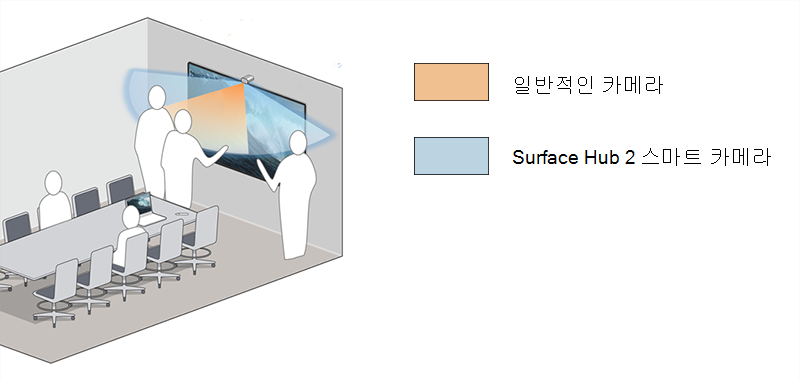

# Surface Hub 2 스마트 카메라 설치 및 관리

Surface Hub 2 Smart Camera1은 하이브리드 팀을 위해 설계되었으며 원격 참가자를 위해 최적화되었습니다. 전경과 배경에 날카로운 초점을 맞춘 원격 참가자는 사람들이 Surface Hub 콘텐츠와 상호 작용하는 것을 보면서 방에있는 다른 모든 사람들을 볼 수 있습니다. Surface Hub 2 스마트 카메라는 136도보다 큰 넓은 시야, 자동 프레이밍, 고품질 유리 광학 및 저조도 센서가 있습니다.

*울트라 와이드 카메라 보기에는 85" 허브의 극단적인 가장자리에 화이트보딩하는 사람들이 포함되어 있습니다.*

## 시스템 요구 사항

팀 OS를 실행하는 Surface Hub의 경우 Surface Hub 2 스마트 카메라를 사용하려면 [Surface Hub 2의 Windows 10 Team 2020 업데이트](surface-hub-2020-update-whats-new.md)(20H2)에 대해 다음 업데이트가 필요합니다.

- Windows 10 Team 2020 업데이트 2(KB5010415 또는 후속 Windows 업데이트)
- 시스템 하드웨어 업데이트 - 2022년 1월 21일(또는 후속 시스템 하드웨어 업데이트)

자세한 내용은 [Surface Hub 업데이트 기록을](surface-hub-update-history.md) 참조하세요.

> [!NOTE]
> Windows 10 또는 Windows 11 Pro/Enterprise 실행하기 위해 마이그레이션된 Surface Hub에 대한 추가 업데이트는 필요하지 않습니다.

## 스마트 카메라 설치

1. Surface Hub 2의 위쪽 가운데에 있는 USB-C 포트에 카메라를 연결합니다. 표시기 LED는 카메라가 연결될 때 잠시 켜지고 카메라가 사용 중일 때 지속적으로 밝아집니다.

     

2. 카메라를 제거하려면 위로 당기고 앞으로 당깁니다. 자기 밧줄은 카메라가 쓰러지거나 뒤로 당겨지는 것을 방지합니다.

    

> [!TIP]
> 카메라 커버는 개인 정보 보호를 위해 전면에 자기적으로 스냅하고 사용하지 않을 때는 스토리지를 위해 뒤로 스냅합니다.

## 자동 프레이밍 설정 관리

자동 프레이밍은 동적으로 확대/축소되며 이동할 때 비디오의 중심을 유지합니다. 설정을 관리하는 방법은 Surface Hub 설치된 OS에 따라 달라집니다.

- [Windows 10 Team 2020 업데이트(20H2)](#windows-10-team-2020-update-20h2)
- [Surface Hub 데스크톱 Windows 11](#windows-11-desktop-on-surface-hub)
- [Surface Hub 데스크톱 Windows 10](#windows-10-desktop-on-surface-hub)

### Windows 10 Team 2020 업데이트(20H2)

Surface Hub 스마트 카메라를 설치하면 기본적으로 자동 프레이밍이 사용됩니다. 관리자는 각 Surface Hub 세션의 시작 부분에 자동 프레이밍 상태를 설정하는 켜기/끄기 토글을 통해 설정 자동 프레이밍을 관리할 수 있습니다.

**자동 프레이밍을 조정하려면 다음을 수행합니다.**

1. Surface Hub 2S에서 **관리자**로 로그인합니다.

> [!NOTE]
> 사용자 이름 또는 관리자 암호를 모르는 경우 디바이스를 다시 설정해야 합니다. 자세한 내용은 [Surface Hub 2S에 대한 다시 설정 및 복구](/surface-hub/surface-hub-2s-recover-reset)를 참조하세요.

2. **설정** 열고 **Surface Hub > 통화 & 오디오**로 이동합니다.
3. **자동 프레이밍**에서 토글을 적절하게 조정합니다. 
4. **세션 종료**를 선택합니다. 수정된 설정은 새 세션을 시작할 때 적용됩니다. 

토글이 **On**으로 설정된 경우 사용자가 Surface Hub 세션을 시작할 때 자동 프레이밍이 항상 기본적으로 설정됩니다. 토글이 **Off**로 설정된 경우 Surface Hub 세션을 시작할 때 자동 프레이밍은 항상 기본적으로 꺼집니다.

#### MDM 공급자를 통해 카메라 설정 관리

관리자는 Intune 또는 타사 MDM(모바일 디바이스 관리) 공급자의 Surface Hub CSP([구성 서비스](/windows/client-management/mdm/surfacehub-csp) 공급자)를 통해 자동 프레이밍을 관리할 수 있습니다.

|CSP 정책 설정| 설명|
|------------------|------------|
|DefaultAutomaticFraming|이 정책 설정을 켜면 자동 프레이밍이 사용됩니다. 이 정책 설정을 해제하면 자동 프레이밍이 비활성화됩니다. 이 정책 설정을 구성하지 않으면 자동 프레이밍이 사용됩니다. |

자세한 내용은 다음을 참조하세요.

- [MDM 공급자를 사용하여 설정 관리](/surface-hub/manage-settings-with-mdm-for-surface-hub#create-custom-configuration-profile)
- [SurfaceHub CSP - Windows 클라이언트 관리](/windows/client-management/mdm/surfacehub-csp)

### Surface Hub 데스크톱 Windows 11

Windows 11 Pro 또는 Windows 11 Enterprise 실행하도록 Surface Hub [마이그레이션한](surface-hub-2s-migrate-os.md) 경우 Surface Hub 스마트 카메라의 자동 프레이밍을 켜야 합니다. 기본적으로 자동 프레이밍은 꺼져 있습니다.

자동 프레이밍을 켜려면 **카메라> Surface Hub 2 스마트 카메라 관리 > 설정 > Bluetooth & 장치로 이동합니다.**

### Surface Hub 데스크톱 Windows 10

자동 프레이밍은 항상 사용하도록 설정되며 사용하지 않도록 설정하거나 구성할 수 없습니다.

## 주문 Surface Hub 2 스마트 카메라

[승인된 Microsoft Surface 재판매인](https://www.microsoft.com/surface/business/where-to-buy-microsoft-surface?)에서 Surface Hub 2개의 스마트 카메라를 구매합니다.

### 참조

1. 2022년 3월 16일부터 별도로 판매되는 Surface Hub 2 스마트 카메라는 원격 참가자를 위한 비디오 피드를 동적으로 조정합니다. Surface Hub 2 스마트 카메라는 2022년 5월부터 Surface Hub 2S 85"가 포함된 상자에 포함됩니다.
