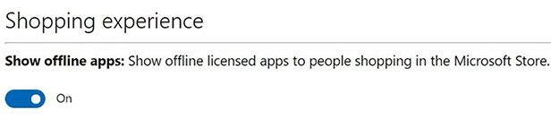

# <span data-ttu-id="756cd-104">비즈니스 및 교육용 Microsoft Store를 통해 Surface 앱 배포</span><span class="sxs-lookup"><span data-stu-id="756cd-104">Deploy Surface app with Microsoft Store for Business and Education</span></span>

**<span data-ttu-id="756cd-105">적용 대상</span><span class="sxs-lookup"><span data-stu-id="756cd-105">Applies to</span></span>**

- <span data-ttu-id="756cd-106">Surface Pro 7+</span><span class="sxs-lookup"><span data-stu-id="756cd-106">Surface Pro 7+</span></span>
- <span data-ttu-id="756cd-107">Surface 노트북 이동</span><span class="sxs-lookup"><span data-stu-id="756cd-107">Surface Laptop Go</span></span>
- <span data-ttu-id="756cd-108">Surface Pro 7</span><span class="sxs-lookup"><span data-stu-id="756cd-108">Surface Pro 7</span></span>
- <span data-ttu-id="756cd-109">Surface 노트북 3</span><span class="sxs-lookup"><span data-stu-id="756cd-109">Surface Laptop 3</span></span>
- <span data-ttu-id="756cd-110">Surface Pro 6</span><span class="sxs-lookup"><span data-stu-id="756cd-110">Surface Pro 6</span></span>
- <span data-ttu-id="756cd-111">Surface Laptop 2</span><span class="sxs-lookup"><span data-stu-id="756cd-111">Surface Laptop 2</span></span>
- <span data-ttu-id="756cd-112">Surface Go</span><span class="sxs-lookup"><span data-stu-id="756cd-112">Surface Go</span></span>
- <span data-ttu-id="756cd-113">Surface Go(LTE 사용)</span><span class="sxs-lookup"><span data-stu-id="756cd-113">Surface Go with LTE</span></span>
- <span data-ttu-id="756cd-114">Surface Book 2</span><span class="sxs-lookup"><span data-stu-id="756cd-114">Surface Book 2</span></span>
- <span data-ttu-id="756cd-115">Surface Pro LTE Advanced(모델 1807)</span><span class="sxs-lookup"><span data-stu-id="756cd-115">Surface Pro with LTE Advanced (Model 1807)</span></span>
- <span data-ttu-id="756cd-116">Surface Pro(모델 1796)</span><span class="sxs-lookup"><span data-stu-id="756cd-116">Surface Pro (Model 1796)</span></span>
- <span data-ttu-id="756cd-117">Surface 노트북</span><span class="sxs-lookup"><span data-stu-id="756cd-117">Surface Laptop</span></span>
- <span data-ttu-id="756cd-118">Surface Studio</span><span class="sxs-lookup"><span data-stu-id="756cd-118">Surface Studio</span></span>
- <span data-ttu-id="756cd-119">Surface Studio 2</span><span class="sxs-lookup"><span data-stu-id="756cd-119">Surface Studio 2</span></span>
- <span data-ttu-id="756cd-120">Surface Book</span><span class="sxs-lookup"><span data-stu-id="756cd-120">Surface Book</span></span>
- <span data-ttu-id="756cd-121">Surface Pro 4</span><span class="sxs-lookup"><span data-stu-id="756cd-121">Surface Pro 4</span></span>
- <span data-ttu-id="756cd-122">Surface 3 LTE</span><span class="sxs-lookup"><span data-stu-id="756cd-122">Surface 3 LTE</span></span>
- <span data-ttu-id="756cd-123">Surface 3</span><span class="sxs-lookup"><span data-stu-id="756cd-123">Surface 3</span></span>
- <span data-ttu-id="756cd-124">Surface Pro 3</span><span class="sxs-lookup"><span data-stu-id="756cd-124">Surface Pro 3</span></span>


<span data-ttu-id="756cd-125">Surface 앱은 다음을 비롯한 다양한 Surface 관련 설정 및 옵션을 제어하는 경량의 Microsoft Store 앱입니다.</span><span class="sxs-lookup"><span data-stu-id="756cd-125">The Surface app is a lightweight Microsoft Store app that provides control of many Surface-specific settings and options, including:</span></span> 

* <span data-ttu-id="756cd-126">Surface 디바이스에서 Windows 단추를 사용하거나 사용하지 않도록 설정</span><span class="sxs-lookup"><span data-stu-id="756cd-126">Enable or disable the Windows button on the Surface device</span></span> 

* <span data-ttu-id="756cd-127">Surface 펜의 감도 조정</span><span class="sxs-lookup"><span data-stu-id="756cd-127">Adjust the sensitivity of a Surface Pen</span></span> 

* <span data-ttu-id="756cd-128">Surface 펜 단추 동작을 사용자 지정</span><span class="sxs-lookup"><span data-stu-id="756cd-128">Customize Surface Pen button actions</span></span> 

* <span data-ttu-id="756cd-129">Surface 오디오의 향상된 기능을 사용하거나 사용하지 않도록 설정</span><span class="sxs-lookup"><span data-stu-id="756cd-129">Enable or disable Surface audio enhancements</span></span> 

* <span data-ttu-id="756cd-130">장치에 대한 설명서 및 정보를 빠르게 지원</span><span class="sxs-lookup"><span data-stu-id="756cd-130">Quick access to support documentation and information for your device</span></span>

<span data-ttu-id="756cd-131">Windows 업데이트를 사용하는 고객은 자동 업데이트의 일부로 Surface 앱을 받게 됩니다.</span><span class="sxs-lookup"><span data-stu-id="756cd-131">Customers using Windows Update will ordinarily receive Surface app as part of automatic updates.</span></span> <span data-ttu-id="756cd-132">그러나 조직에서 Surface 디바이스에 배포할 이미지를 준비하는 경우 각 개별 디바이스의 사용자에게 Microsoft Store 또는 비즈니스용 Microsoft Store에서 앱을 다운로드하여 설치하도록 요구하는 대신 이미징 및 배포 프로세스에 Surface 앱(이전의 Surface Hub)을 포함할 수 있습니다.</span><span class="sxs-lookup"><span data-stu-id="756cd-132">But if your organization is preparing images for deployment to your Surface devices, you may want to include the Surface app (formerly called the Surface Hub) in your imaging and deployment process instead of requiring users of each individual device to download and install the app from the Microsoft Store or your Microsoft Store for Business.</span></span> 

> [!NOTE]
> <span data-ttu-id="756cd-133">이 문서는 Surface Pro X에는 적용되지 않습니다. 자세한 내용은 Surface [Pro X 배포,](surface-pro-arm-app-management.md) 관리 및 서비스 참조</span><span class="sxs-lookup"><span data-stu-id="756cd-133">This article does not apply to Surface Pro X. For more information, refer to [Deploying, managing, and servicing Surface Pro X](surface-pro-arm-app-management.md)</span></span>

## <span data-ttu-id="756cd-134">Surface 앱 개요</span><span class="sxs-lookup"><span data-stu-id="756cd-134">Surface app overview</span></span>

<span data-ttu-id="756cd-135">Surface 앱은 Microsoft Store에서 무료로 다운로드할 [수 있습니다.](https://www.microsoft.com/store/apps/Surface/9WZDNCRFJB8P)</span><span class="sxs-lookup"><span data-stu-id="756cd-135">The Surface app is available as a free download from the [Microsoft Store](https://www.microsoft.com/store/apps/Surface/9WZDNCRFJB8P).</span></span> <span data-ttu-id="756cd-136">사용자는 Microsoft Store에서 다운로드하여 설치할 수 있지만 조직에서 비즈니스용 Microsoft Store를 대신 사용하는 경우 스토어의 인벤토리에 추가하고 Windows 배포 프로세스의 일부로 앱을 포함해야 합니다.</span><span class="sxs-lookup"><span data-stu-id="756cd-136">Users can download and install it from the Microsoft Store, but if your organization uses Microsoft Store for Business instead, you will need to add it to your store’s inventory and possibly include the app as part of your Windows deployment process.</span></span> <span data-ttu-id="756cd-137">이러한 프로세스는 이 문서 전체에서 설명됩니다.</span><span class="sxs-lookup"><span data-stu-id="756cd-137">These processes are discussed throughout this article.</span></span> <span data-ttu-id="756cd-138">비즈니스용 Microsoft Store에 대한 자세한 내용은 Windows TechCenter의 비즈니스용 [Microsoft Store를](https://docs.microsoft.com/microsoft-store/) 참조하세요.</span><span class="sxs-lookup"><span data-stu-id="756cd-138">For more information about Microsoft Store for Business, see [Microsoft Store for Business](https://docs.microsoft.com/microsoft-store/) in the Windows TechCenter.</span></span> 

## <span data-ttu-id="756cd-139">비즈니스용 Microsoft Store 계정에 Surface 앱 추가</span><span class="sxs-lookup"><span data-stu-id="756cd-139">Add Surface app to a Microsoft Store for Business account</span></span> 

<span data-ttu-id="756cd-140">사용자가 회사의 비즈니스용 Microsoft Store 계정에서 앱을 설치하거나 배포하려면 먼저 원하는 앱을 사용할 수 있도록 설정하고 비즈니스 사용자에게 라이선스를 부여해야 합니다.</span><span class="sxs-lookup"><span data-stu-id="756cd-140">Before users can install or deploy an app from a company’s Microsoft Store for Business account, the desired app(s) must first be made available and licensed to the users of a business.</span></span> 

1. <span data-ttu-id="756cd-141">아직 수행하지 않은 경우 비즈니스용 Microsoft Store 계정을 [만드시다.](https://www.microsoft.com/business-store)</span><span class="sxs-lookup"><span data-stu-id="756cd-141">If you have not already done so, create a [Microsoft Store for Business account](https://www.microsoft.com/business-store).</span></span> 

2. <span data-ttu-id="756cd-142">포털에 로그온합니다.</span><span class="sxs-lookup"><span data-stu-id="756cd-142">Log on to the portal.</span></span> 

3. <span data-ttu-id="756cd-143">오프라인 라이선싱 사용: 그림 1에 **표시된**>\*\*\*\* 스토어 설정 관리 및 스토어에서 쇼핑하는 사용자에 대해 오프라인 사용이 허가된 앱 표시를 선택합니다.</span><span class="sxs-lookup"><span data-stu-id="756cd-143">Enable offline licensing: click **Manage->Store settings**, and then select the **Show offline licensed apps to people shopping in the store** checkbox, as shown in Figure 1.</span></span> <span data-ttu-id="756cd-144">비즈니스용 Microsoft Store 앱 라이선싱 모델에 대한 자세한 내용은 비즈니스 및 교육용 [Microsoft Store의 앱을 참조하세요.](https://docs.microsoft.com/microsoft-store/)</span><span class="sxs-lookup"><span data-stu-id="756cd-144">For more information about Microsoft Store for Business app licensing models, see [Apps in Microsoft Store for Business and Education](https://docs.microsoft.com/microsoft-store/).</span></span>

   > [!div class="mx-imgBorder"]
   > <br/>
   *<span data-ttu-id="756cd-146">그림 1.</span><span class="sxs-lookup"><span data-stu-id="756cd-146">Figure 1.</span></span> <span data-ttu-id="756cd-147">오프라인에서 사용할 수 있도록 앱 사용</span><span class="sxs-lookup"><span data-stu-id="756cd-147">Enable apps for offline use</span></span>*

4. <span data-ttu-id="756cd-148">다음 절차에 따라 비즈니스용 Microsoft Store 계정에 Surface 앱을 추가합니다.</span><span class="sxs-lookup"><span data-stu-id="756cd-148">Add Surface app to your Microsoft Store for Business account by following this procedure:</span></span>

    * <span data-ttu-id="756cd-149">쇼핑 **메뉴를** 클릭합니다.</span><span class="sxs-lookup"><span data-stu-id="756cd-149">Click the **Shop** menu.</span></span>
    
    * <span data-ttu-id="756cd-150">검색 상자에 **Surface 앱을 입력한**다음 검색 아이콘을 클릭합니다.</span><span class="sxs-lookup"><span data-stu-id="756cd-150">In the search box, type **Surface app**, and then click the search icon.</span></span>
    
    * <span data-ttu-id="756cd-151">Surface 앱이 검색 결과에 표시된 후 앱의 아이콘을 클릭합니다.</span><span class="sxs-lookup"><span data-stu-id="756cd-151">After the Surface app is presented in the search results, click the app’s icon.</span></span>
    
    * <span data-ttu-id="756cd-152">그림 2에 표시된 \*\*\*\* 같이 \*\*\*\* 선택(온라인 또는 오프라인 선택)이 표시됩니다.</span><span class="sxs-lookup"><span data-stu-id="756cd-152">You are presented with a choice (select **Online** or **Offline**), as shown in Figure 2.</span></span>
    
      > [!div class="mx-imgBorder"]
      >    
      *<span data-ttu-id="756cd-154">그림 2.</span><span class="sxs-lookup"><span data-stu-id="756cd-154">Figure 2.</span></span> <span data-ttu-id="756cd-155">오프라인 라이선싱 모드를 선택하고 인벤토리에 앱 추가</span><span class="sxs-lookup"><span data-stu-id="756cd-155">Select the Offline licensing mode and add the app to your inventory</span></span>*
    
    * <span data-ttu-id="756cd-156">오프라인을 **클릭하여** 오프라인 라이선싱 모드를 선택합니다.</span><span class="sxs-lookup"><span data-stu-id="756cd-156">Click **Offline** to select the Offline licensing mode.</span></span>
    
    * <span data-ttu-id="756cd-157">앱 **다운로드를 클릭하여** 비즈니스용 Microsoft Store 인벤토리에 앱을 추가합니다.</span><span class="sxs-lookup"><span data-stu-id="756cd-157">Click **Get the app** to add the app to your Microsoft Store for Business inventory.</span></span> <span data-ttu-id="756cd-158">그림 3과 같이 관리 도구를 사용하여 오프라인 앱을 배포하거나 개인 저장소의 회사의 인벤토리 페이지에서 다운로드할 수 있습니다.</span><span class="sxs-lookup"><span data-stu-id="756cd-158">As shown in Figure 3, you’ll see a dialog box that prompts you to acknowledge that offline apps can be deployed using a management tool or downloaded from the company’s inventory page in their private store.</span></span>
    
      > [!div class="mx-imgBorder"]
      > 
       *그림 3. 오프라인 라이선스 앱* 인정</span><span class="sxs-lookup"><span data-stu-id="756cd-159">Offline-licensed app acknowledgement window](images/deploysurfapp-fig3-acknowledge.png "Offline-licensed app acknowledgement window")
*Figure 3. Offline-licensed app acknowledgement*</span></span>
      
    * <span data-ttu-id="756cd-160">**확인**을 클릭합니다.</span><span class="sxs-lookup"><span data-stu-id="756cd-160">Click **OK**.</span></span>

## <span data-ttu-id="756cd-161">비즈니스용 Microsoft Store 계정에서 Surface 앱 다운로드</span><span class="sxs-lookup"><span data-stu-id="756cd-161">Download Surface app from a Microsoft Store for Business account</span></span>
<span data-ttu-id="756cd-162">오프라인 모드에서 비즈니스용 Microsoft Store 계정에 앱을 추가한 후 앱을 다운로드하여 배포 공유에 AppxBundle로 추가할 수 있습니다.</span><span class="sxs-lookup"><span data-stu-id="756cd-162">After you add an app to the Microsoft Store for Business account in Offline mode, you can download and add the app as an AppxBundle to a deployment share.</span></span>

1. <span data-ttu-id="756cd-163">에서 비즈니스용 Microsoft Store 계정에 https://businessstore.microsoft.com 로그온합니다.</span><span class="sxs-lookup"><span data-stu-id="756cd-163">Log on to the Microsoft Store for Business account at https://businessstore.microsoft.com.</span></span>

2. <span data-ttu-id="756cd-164">**Manage->Apps & 클릭합니다.**</span><span class="sxs-lookup"><span data-stu-id="756cd-164">Click **Manage->Apps & software**.</span></span> <span data-ttu-id="756cd-165">이 문서의 비즈니스용 [Microsoft Store](#add-surface-app-to-a-microsoft-store-for-business-account) 계정 섹션에 Surface 앱 추가에 추가한 Surface 앱을 포함하여 모든 회사의 앱 목록이 표시됩니다.</span><span class="sxs-lookup"><span data-stu-id="756cd-165">A list of all of your company’s apps is displayed, including the Surface app you added in the [Add Surface app to a Microsoft Store for Business account](#add-surface-app-to-a-microsoft-store-for-business-account) section of this article.</span></span>

3. <span data-ttu-id="756cd-166">작업 **아래에서**타원(...\*\*\*\*)을 클릭한 다음 Surface 앱에 오프라인으로 사용할 수 **있는** 다운로드를 클릭합니다.</span><span class="sxs-lookup"><span data-stu-id="756cd-166">Under **Actions**, click the ellipsis (**…**), and then click **Download for offline use** for the Surface app.</span></span>

4. <span data-ttu-id="756cd-167">그림 4에 표시된 **같이** 선택한 앱에 대해 사용 가능한 선택에서 원하는 플랫폼 및 아키텍처 옵션을 선택합니다. \*\*\*\*</span><span class="sxs-lookup"><span data-stu-id="756cd-167">Select the desired **Platform** and **Architecture** options from the available selections for the selected app, as shown in Figure 4.</span></span>

    > [!div class="mx-imgBorder"]
    > <br/>
    *<span data-ttu-id="756cd-169">그림 4.</span><span class="sxs-lookup"><span data-stu-id="756cd-169">Figure 4.</span></span> <span data-ttu-id="756cd-170">앱용 AppxBundle 패키지 다운로드</span><span class="sxs-lookup"><span data-stu-id="756cd-170">Download the AppxBundle package for an app</span></span>*
    
5. <span data-ttu-id="756cd-171">다운로드를 **클릭합니다.**</span><span class="sxs-lookup"><span data-stu-id="756cd-171">Click **Download**.</span></span> <span data-ttu-id="756cd-172">AppxBundle 패키지가 다운로드됩니다.</span><span class="sxs-lookup"><span data-stu-id="756cd-172">The AppxBundle package will be downloaded.</span></span> <span data-ttu-id="756cd-173">다운로드한 파일의 경로는 이 문서의 부분에 필요하기 때문에 주의해야 합니다.</span><span class="sxs-lookup"><span data-stu-id="756cd-173">Make sure you note the path of the downloaded file because you’ll need that later in this article.</span></span>

6. <span data-ttu-id="756cd-174">인코딩된 **라이선스** 또는 인코딩되지 않은 라이선스 **옵션을** 클릭합니다.</span><span class="sxs-lookup"><span data-stu-id="756cd-174">Click either the **Encoded license** or **Unencoded license** option.</span></span> <span data-ttu-id="756cd-175">Microsoft Endpoint Configuration Manager와 같은 관리 도구에서 또는 Windows 구성 디자이너를 사용하여 프로비저닝 패키지를 만들 때 인코딩된 라이선스 옵션을 사용합니다.</span><span class="sxs-lookup"><span data-stu-id="756cd-175">Use the Encoded license option with management tools like Microsoft Endpoint Configuration Manager or when you use Windows Configuration Designer to create a provisioning package.</span></span> <span data-ttu-id="756cd-176">MDT(Microsoft Deployment Toolkit)를 포함하여 이미징을 기반으로 DISM(배포 이미지 서비스 및 관리) 또는 배포 솔루션을 사용하는 경우 인코딩되지 않은 라이선스 옵션을 선택합니다.</span><span class="sxs-lookup"><span data-stu-id="756cd-176">Select the Unencoded license option when you use Deployment Image Servicing and Management (DISM) or deployment solutions based on imaging, including the Microsoft Deployment Toolkit (MDT).</span></span>

7. <span data-ttu-id="756cd-177">**생성을** 클릭하여 앱에 대한 라이선스를 생성하고 다운로드합니다.</span><span class="sxs-lookup"><span data-stu-id="756cd-177">Click **Generate** to generate and download the license for the app.</span></span> <span data-ttu-id="756cd-178">라이선스 파일의 경로는 이 문서의 부분에 필요하기 때문에 주의해야 합니다.</span><span class="sxs-lookup"><span data-stu-id="756cd-178">Make sure you note the path of the license file because you’ll need that later in this article.</span></span>

>[!NOTE]
><span data-ttu-id="756cd-179">Surface 앱과 같이 오프라인으로 사용하기 위해 앱을 다운로드할 때 레이블이 붙은 필수 프레임워크 페이지 아래쪽에 섹션이 **표시될 수 있습니다.**</span><span class="sxs-lookup"><span data-stu-id="756cd-179">When you download an app for offline use, such as the Surface app, you may notice a section at the bottom of the page labeled **Required frameworks**.</span></span> <span data-ttu-id="756cd-180">대상 컴퓨터에는 앱이 실행될 수 있도록 프레임워크가 설치되어 있어야 있으므로 아키텍처에 필요한 각 프레임워크(x86 또는 x64)에 대한 다운로드 프로세스를 반복하고 이 문서 나중에 설명하는 Windows 배포의 일부로 포함해야 할 수 있습니다.</span><span class="sxs-lookup"><span data-stu-id="756cd-180">Your target computers must have the frameworks installed for the app to run, so you may need to repeat the download process for each of the required frameworks for your architecture (either x86 or x64) and also include them as part of your Windows deployment discussed later in this article.</span></span>

<span data-ttu-id="756cd-181">그림 5에서는 Surface 앱에 필요한 프레임워크를 보여줍니다.</span><span class="sxs-lookup"><span data-stu-id="756cd-181">Figure 5 shows the required frameworks for the Surface app.</span></span>

> [!div class="mx-imgBorder"]
> <br/>
*<span data-ttu-id="756cd-183">그림 5.</span><span class="sxs-lookup"><span data-stu-id="756cd-183">Figure 5.</span></span> <span data-ttu-id="756cd-184">Surface 앱에 필요한 프레임워크</span><span class="sxs-lookup"><span data-stu-id="756cd-184">Required frameworks for the Surface app</span></span>*

>[!NOTE]
><span data-ttu-id="756cd-185">Surface 앱의 버전 번호와 필수 프레임워크는 앱이 업데이트될 때 변경됩니다.</span><span class="sxs-lookup"><span data-stu-id="756cd-185">The version numbers of the Surface app and required frameworks will change as the apps are updated.</span></span> <span data-ttu-id="756cd-186">비즈니스용 Microsoft Store에서 최신 버전의 Surface 앱 및 각 프레임워크를 확인할 수 있습니다.</span><span class="sxs-lookup"><span data-stu-id="756cd-186">Check for the latest version of Surface app and each framework in Microsoft Store for Business.</span></span> <span data-ttu-id="756cd-187">비즈니스용 Microsoft Store에서 제공하는 Surface 앱 및 권장 프레임워크 버전을 항상 사용하세요.</span><span class="sxs-lookup"><span data-stu-id="756cd-187">Always use the Surface app and recommended framework versions as provided by Microsoft Store for Business.</span></span> <span data-ttu-id="756cd-188">더 이상 사용되지 않은 프레임워크 또는 잘못된 버전을 사용할 경우 오류나 응용 프로그램 충돌이 발생할 수 있습니다.</span><span class="sxs-lookup"><span data-stu-id="756cd-188">Using outdated frameworks or the incorrect versions may result in errors or application crashes.</span></span>

<span data-ttu-id="756cd-189">Surface 앱에 필요한 프레임워크를 다운로드하려면 다음 단계를 따르세요.</span><span class="sxs-lookup"><span data-stu-id="756cd-189">To download the required frameworks for the Surface app, follow these steps:</span></span>

1. <span data-ttu-id="756cd-190">\*\*\*\* **Microsoft.VCLibs.140.00_14.0.23816.0_x64__8wekyb3d8bbwe에서 다운로드 단추를 클릭합니다.**</span><span class="sxs-lookup"><span data-stu-id="756cd-190">Click the **Download** button under **Microsoft.VCLibs.140.00_14.0.23816.0_x64__8wekyb3d8bbwe**.</span></span> <span data-ttu-id="756cd-191">이렇게 하여 Microsoft.VCLibs.140.00_14.0.23816.0_x64__8wekyb3d8bbwe를 다운로드합니다. 지정된 폴더에 대한 Appx 파일입니다.</span><span class="sxs-lookup"><span data-stu-id="756cd-191">This downloads the Microsoft.VCLibs.140.00_14.0.23816.0_x64__8wekyb3d8bbwe.Appx file to your specified folder.</span></span>

2. <span data-ttu-id="756cd-192">**Microsoft.NET.Native.Runtime.1.1_1.1.23406.0_x64__8wekyb3d8bbwe**아래의 다운로드 단추를 클릭합니다. \*\*\*\*</span><span class="sxs-lookup"><span data-stu-id="756cd-192">Click the **Download** button under **Microsoft.NET.Native.Runtime.1.1_1.1.23406.0_x64__8wekyb3d8bbwe**.</span></span> <span data-ttu-id="756cd-193">그러면 Microsoft.NET.Native.Runtime.1.1_1.1.23406.0_x64__8wekyb3d8bbwe.Appx 파일을 지정된 폴더로 다운로드합니다.</span><span class="sxs-lookup"><span data-stu-id="756cd-193">This downloads the Microsoft.NET.Native.Runtime.1.1_1.1.23406.0_x64__8wekyb3d8bbwe.Appx file to your specified folder.</span></span>

>[!NOTE]
><span data-ttu-id="756cd-194">Surface 디바이스에는 각 프레임워크의 64비트(x64) 버전만 필요합니다.</span><span class="sxs-lookup"><span data-stu-id="756cd-194">Only the 64-bit (x64) version of each framework is required for Surface devices.</span></span> <span data-ttu-id="756cd-195">Surface 장치는 네이티브 64비트 UEFI 장치로, 32비트 프레임워크가 필요한 32비트(x86) 버전의 Windows와 호환되지 않습니다.</span><span class="sxs-lookup"><span data-stu-id="756cd-195">Surface devices are native 64-bit UEFI devices and are not compatible with 32-bit (x86) versions of Windows that would require 32-bit frameworks.</span></span> 

## <span data-ttu-id="756cd-196">PowerShell을 통해 컴퓨터에 Surface 앱 설치</span><span class="sxs-lookup"><span data-stu-id="756cd-196">Install Surface app on your computer with PowerShell</span></span>
<span data-ttu-id="756cd-197">다음 절차에서는 Surface 앱을 컴퓨터에 프로비전하고 이후에 컴퓨터에서 만든 모든 사용자 계정에 사용할 수 있도록 합니다.</span><span class="sxs-lookup"><span data-stu-id="756cd-197">The following procedure provisions the Surface app onto your computer and makes it available for any user accounts created on the computer afterwards.</span></span>

1. <span data-ttu-id="756cd-198">이 문서의 비즈니스용 [Microsoft Store](#download-surface-app-from-a-microsoft-store-for-business-account) 계정 섹션에서 Surface 앱을 다운로드하는 방법 섹션에 설명된 절차를 사용하여 Surface app AppxBundle 및 라이선스 파일을 다운로드합니다.</span><span class="sxs-lookup"><span data-stu-id="756cd-198">Using the procedure described in the [How to download Surface app from a Microsoft Store for Business account](#download-surface-app-from-a-microsoft-store-for-business-account) section of this article, download the Surface app AppxBundle and license file.</span></span> 

2. <span data-ttu-id="756cd-199">관리자 권한 PowerShell 세션을 시작합니다.</span><span class="sxs-lookup"><span data-stu-id="756cd-199">Begin an elevated PowerShell session.</span></span>

    >[!NOTE]
    ><span data-ttu-id="756cd-200">관리자 권한으로 PowerShell을 실행하지 않는 경우 세션에 앱을 설치하는 데 필요한 권한이 없습니다.</span><span class="sxs-lookup"><span data-stu-id="756cd-200">If you don’t run PowerShell as an Administrator, the session won’t have the required permissions to install the app.</span></span>
    
3. <span data-ttu-id="756cd-201">관리자 권한 PowerShell 세션에서 다음 명령을 복사한 다음 붙여넣습니다.</span><span class="sxs-lookup"><span data-stu-id="756cd-201">In the elevated PowerShell session, copy and paste the following command:</span></span>

    ```powershell
    Add-AppxProvisionedPackage –Online –PackagePath <DownloadPath>\ Microsoft.SurfaceHub_10.0.342.0_neutral_~_8wekyb3d8bbwe.AppxBundle –LicensePath <DownloadPath>\ Microsoft.SurfaceHub_8wekyb3d8bbwe_a53ef8ab-9dbd-dec1-46c5-7b664d4dd003.xml
    ```

    <span data-ttu-id="756cd-202">비즈니스용 Microsoft Store 계정에서 AppxBundle 및 라이선스 파일을 다운로드한 `<DownloadPath>` 폴더는 어디에 있나요?</span><span class="sxs-lookup"><span data-stu-id="756cd-202">Where `<DownloadPath>` is the folder where you downloaded the AppxBundle and license file from the Microsoft Store for Business account.</span></span>

    <span data-ttu-id="756cd-203">예를 들어 파일을 c:\Temp에 다운로드한 경우 실행되는 명령은 다음과 같습니다.</span><span class="sxs-lookup"><span data-stu-id="756cd-203">For example, if you downloaded the files to c:\Temp, the command you run is:</span></span>
    
    ```powershell
    Add-AppxProvisionedPackage –Online –PackagePath c:\Temp\ Microsoft.SurfaceHub_10.0.342.0_neutral_~_8wekyb3d8bbwe.AppxBundle –LicensePath c:\Temp\ Microsoft.SurfaceHub_8wekyb3d8bbwe_a53ef8ab-9dbd-dec1-46c5-7b664d4dd003.xml
    ```

4. <span data-ttu-id="756cd-204">이제 Surface 앱을 현재 Windows 컴퓨터에서 사용할 수 있습니다.</span><span class="sxs-lookup"><span data-stu-id="756cd-204">The Surface app will now be available on your current Windows computer.</span></span> 

   <span data-ttu-id="756cd-205">Surface 앱이 프로비전된 컴퓨터에서 작동하려면 이 문서 앞부분에서 설명한 프레임워크도 프로비전해야 합니다.</span><span class="sxs-lookup"><span data-stu-id="756cd-205">Before the Surface app is functional on the computer where it has been provisioned, you must also provision the frameworks described earlier in this article.</span></span> <span data-ttu-id="756cd-206">이러한 프레임워크를 프로비전하기 위해 Surface 앱을 프로비전하는 데 사용한 상승된 PowerShell 세션에서 다음 절차를 사용합니다.</span><span class="sxs-lookup"><span data-stu-id="756cd-206">To provision these frameworks, use the following procedure in the elevated PowerShell session you used to provision the Surface app.</span></span>

5. <span data-ttu-id="756cd-207">관리자 권한 PowerShell 세션에서 다음 명령을 복사한 다음 붙여넣습니다.</span><span class="sxs-lookup"><span data-stu-id="756cd-207">In the elevated PowerShell session, copy and paste the following command:</span></span>

   ```powershell
   Add-AppxProvisionedPackage –Online –SkipLicense –PackagePath <DownloadPath>\Microsoft.VCLibs.140.00_14.0.23816.0_x64__8wekyb3d8bbwe.Appx
   ```
   
6. <span data-ttu-id="756cd-208">관리자 권한 PowerShell 세션에서 다음 명령을 복사한 다음 붙여넣습니다.</span><span class="sxs-lookup"><span data-stu-id="756cd-208">In the elevated PowerShell session, copy and paste the following command:</span></span>

   ```powershell
   Add-AppxProvisionedPackage –Online –SkipLicense –PackagePath <DownloadPath>\Microsoft.NET.Native.Runtime.1.1_1.1.23406.0_x64__8wekyb3d8bbwe.Appx
   ```

## <span data-ttu-id="756cd-209">MDT를 통해 Surface 앱 설치</span><span class="sxs-lookup"><span data-stu-id="756cd-209">Install Surface app with MDT</span></span>
<span data-ttu-id="756cd-210">다음 절차에서는 MDT를 사용하여 배포 시 Surface 앱의 설치를 자동화합니다.</span><span class="sxs-lookup"><span data-stu-id="756cd-210">The following procedure uses MDT to automate installation of the Surface app at the time of deployment.</span></span> <span data-ttu-id="756cd-211">응용 프로그램은 배포 중 MDT에서 자동으로 프로비전되어 기존 이미지로 이 프로세스를 사용할 수 있습니다.</span><span class="sxs-lookup"><span data-stu-id="756cd-211">The application is provisioned automatically by MDT during deployment and thus you can use this process with existing images.</span></span> <span data-ttu-id="756cd-212">Windows 이미지의 플랫폼 간 호환성을 줄이지 못하기 때문에 Surface 앱을 Surface 디바이스에 Windows 배포의 일부로 배포하는 것이 좋습니다.</span><span class="sxs-lookup"><span data-stu-id="756cd-212">This is the recommended process to deploy the Surface app as part of a Windows deployment to Surface devices because it does not reduce the cross platform compatibility of the Windows image.</span></span>

1. <span data-ttu-id="756cd-213">이 문서의 [](#download-surface-app-from-a-microsoft-store-for-business-account)앞부분에서 설명한 절차를 사용하여 Surface app AppxBundle 및 라이선스 파일을 다운로드합니다.</span><span class="sxs-lookup"><span data-stu-id="756cd-213">Using the procedure described [earlier in this article](#download-surface-app-from-a-microsoft-store-for-business-account), download the Surface app AppxBundle and license file.</span></span> 

2. <span data-ttu-id="756cd-214">MDT Deployment Workbench에서 새 응용 프로그램 마법사를 사용하여 다운로드한 파일을 원본 파일이 있는 새 **응용 프로그램으로 가져와야 합니다.**</span><span class="sxs-lookup"><span data-stu-id="756cd-214">Using the New Application Wizard in the MDT Deployment Workbench, import the downloaded files as a new **Application with source files**.</span></span>

3. <span data-ttu-id="756cd-215">새 응용 **프로그램** 마법사의 명령 세부 정보 \*\*\*\* 페이지에서 기본 작업 \*\*\*\* 디렉터리를 지정하고 명령에 대해 다음과 같이 AppxBundle의 파일 이름을 지정합니다.</span><span class="sxs-lookup"><span data-stu-id="756cd-215">On the **Command Details** page of the New Application Wizard, specify the default **Working Directory** and for the **Command** specify the file name of the AppxBundle, as follows:</span></span>

   * <span data-ttu-id="756cd-216">명령:</span><span class="sxs-lookup"><span data-stu-id="756cd-216">Command:</span></span>
   
     ```console
     Microsoft.SurfaceHub_10.0.342.0_neutral_~_8wekyb3d8bbwe.AppxBundle
     ```
     
   * <span data-ttu-id="756cd-217">작업 디렉터리: %DEPLOYROOT%\Applications\SurfaceApp</span><span class="sxs-lookup"><span data-stu-id="756cd-217">Working Directory: %DEPLOYROOT%\Applications\SurfaceApp</span></span>

<span data-ttu-id="756cd-218">Surface 앱이 대상 컴퓨터에서 작동하려면 이 문서 앞부분에서 설명한 프레임워크도 필요하게 됩니다.</span><span class="sxs-lookup"><span data-stu-id="756cd-218">For the Surface app to function on the target computer, it will also require the frameworks described earlier in this article.</span></span> <span data-ttu-id="756cd-219">다음 절차에 따라 Surface 앱에 필요한 프레임워크를 MDT로 가져오고 종속성으로 구성합니다.</span><span class="sxs-lookup"><span data-stu-id="756cd-219">Use the following procedure to import the frameworks required for the Surface app into MDT and to configure them as dependencies.</span></span>

1. <span data-ttu-id="756cd-220">이 문서의 앞부분에서 설명한 절차를 사용하여 프레임워크 파일을 다운로드합니다.</span><span class="sxs-lookup"><span data-stu-id="756cd-220">Using the procedure described earlier in this article, download the framework files.</span></span> <span data-ttu-id="756cd-221">각 프레임워크를 별도의 폴더에 저장합니다.</span><span class="sxs-lookup"><span data-stu-id="756cd-221">Store each framework in a separate folder.</span></span>

2. <span data-ttu-id="756cd-222">MDT Deployment Workbench에서 새 응용 프로그램 마법사를 사용하여 다운로드한 파일을 원본 파일이 있는 새 **응용 프로그램으로 가져와야 합니다.**</span><span class="sxs-lookup"><span data-stu-id="756cd-222">Using the New Application Wizard in the MDT Deployment Workbench, import the downloaded files as a new **Application with source files**.</span></span>

3. <span data-ttu-id="756cd-223">명령 세부 **정보** 페이지에서 다운로드한 각 응용 프로그램의 파일 \*\*\*\* 이름과 기본 Working Directory를 명령 필드에 입력합니다.</span><span class="sxs-lookup"><span data-stu-id="756cd-223">On the **Command Details** page, type the file name of each application you downloaded in the **Command** field and the default Working Directory.</span></span>

<span data-ttu-id="756cd-224">Surface 앱의 종속성으로 프레임워크를 구성하기 위해 다음 프로세스를 사용하세요.</span><span class="sxs-lookup"><span data-stu-id="756cd-224">To configure the frameworks as dependencies of the Surface app, use this process:</span></span>

1. <span data-ttu-id="756cd-225">MDT Deployment Workbench에서 Surface 앱의 속성을 여십시오.</span><span class="sxs-lookup"><span data-stu-id="756cd-225">Open the properties of the Surface app in the MDT Deployment Workbench.</span></span>

2. <span data-ttu-id="756cd-226">**종속성 탭을 클릭한** 다음 추가를 **클릭합니다.**</span><span class="sxs-lookup"><span data-stu-id="756cd-226">Click the **Dependencies** tab, and then click **Add**.</span></span>

3. <span data-ttu-id="756cd-227">새 응용 프로그램 마법사에서 제공한 이름을 사용하여 각 프레임워크의 확인란을 선택합니다.</span><span class="sxs-lookup"><span data-stu-id="756cd-227">Select the check box for each framework using the name you provided in the New Application Wizard.</span></span>

<span data-ttu-id="756cd-228">가져온 후 Windows 배포 마법사의 응용 \*\*\*\* 프로그램 단계에서 Surface 앱을 사용할 수 있습니다.</span><span class="sxs-lookup"><span data-stu-id="756cd-228">After import, the Surface app will be available for selection in the **Applications** step of the Windows Deployment Wizard.</span></span> <span data-ttu-id="756cd-229">다음 프로세스에 따라 배포 작업 순서에서 응용 프로그램을 지정하여 응용 프로그램을 자동으로 설치할 수도 있습니다.</span><span class="sxs-lookup"><span data-stu-id="756cd-229">You can also install the application automatically by specifying the application in the deployment task sequence by following this process:</span></span>

1. <span data-ttu-id="756cd-230">MDT Deployment Workbench에서 배포 작업 순서를 엽니다.</span><span class="sxs-lookup"><span data-stu-id="756cd-230">Open your deployment task sequence in the MDT Deployment Workbench.</span></span>

2. <span data-ttu-id="756cd-231">배포의 **State Restore**(상태 복원) 섹션에서 새로운 **Install Application**(응용 프로그램 설치) 작업을 추가합니다.</span><span class="sxs-lookup"><span data-stu-id="756cd-231">Add a new **Install Application** task in the **State Restore** section of deployment.</span></span>

3. <span data-ttu-id="756cd-232">단일 **응용 프로그램 설치를** 선택하고 설치할 응용 프로그램으로 **Surface App을** **지정합니다.**</span><span class="sxs-lookup"><span data-stu-id="756cd-232">Select **Install a single application** and specify the **Surface App** as the **Application to be installed**.</span></span>

<span data-ttu-id="756cd-233">Windows 배포에 앱을 포함하는 데 대한 자세한 내용은 Microsoft Deployment [10을 사용하여 Windows 10 배포를](https://technet.microsoft.com/itpro/windows/deploy/deploy-windows-10-with-the-microsoft-deployment-toolkit)Toolkit.</span><span class="sxs-lookup"><span data-stu-id="756cd-233">For more information about including apps into your Windows deployments, see [Deploy Windows 10 with the Microsoft Deployment Toolkit](https://technet.microsoft.com/itpro/windows/deploy/deploy-windows-10-with-the-microsoft-deployment-toolkit).</span></span>
