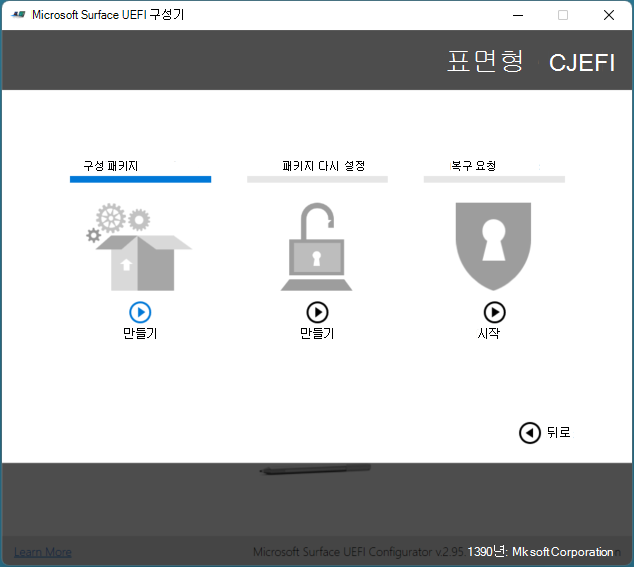
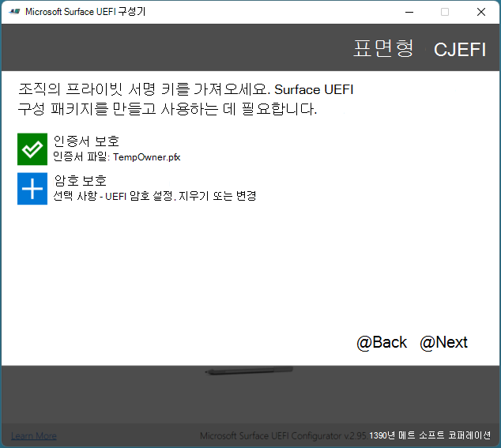
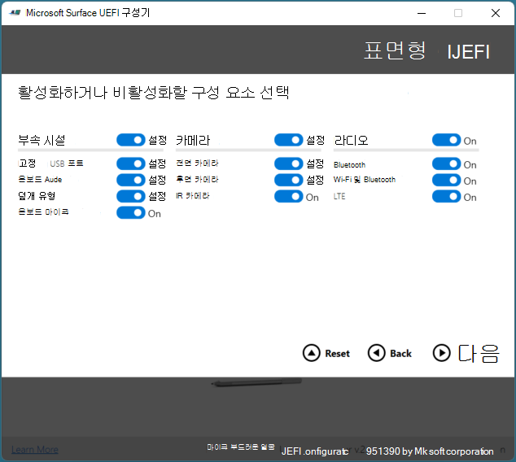
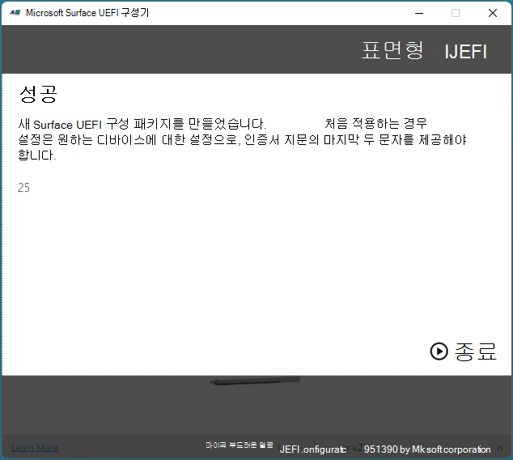

# SEMM을 사용하여 Surface 장치 등록 및 구성

Microsoft Surface Enterprise SEMM(관리 모드)을 사용하면 Surface 디바이스에서 Surface UEFI 설정을 안전하게 구성하고 조직의 Surface 디바이스에서 이러한 설정을 관리할 수 있습니다. Surface 디바이스가 SEMM에서 관리되는 경우 해당 디바이스는 등록된 것으로 *간주됩니다(활성화된* 장치라고도 합니다). 이 문서에서는 Surface UEFI의 설정을 제어할 뿐만 아니라 SEMM에 Surface 디바이스를 등록하는 Surface UEFI 구성 패키지를 만드는 방법을 보여줍니다.

SEMM에 대한 자세한 개요는 Microsoft Surface Enterprise [관리 모드를 참조하세요.](https://technet.microsoft.com/itpro/surface/surface-enterprise-management-mode)

SEMM의 대안으로, 새로운 Surface 디바이스는 펌웨어 설정의 하위 집합을 원격으로 관리하기 위해 Microsoft Intune. 자세한 내용은 Surface [UEFI 설정의 Intune 관리를 참조하세요.](surface-manage-dfci-guide.md)

> [!NOTE]
> SEMM은 UEFI Surface Pro X에서만 지원됩니다. 자세한 내용은 [X에서 배포, 관리 및 Surface Pro 참조하세요.](surface-pro-arm-app-management.md)

#### Microsoft Surface UEFI 구성기 다운로드 및 설치

SEMM 패키지를 만드는 데 사용되는 도구는 Microsoft Surface UEFI 구성기입니다. Microsoft Surface UEFI 구성기는 Microsoft 다운로드 센터의 [Surface Tools for IT(IT용 Surface 도구)](https://www.microsoft.com/download/details.aspx?id=46703) 페이지에서 다운로드할 수 있습니다.
Microsoft Surface UEFI Configurator Windows Installer(.msi) 파일을 실행하여 도구 설치를 시작할 수 있습니다. 설치 관리자를 완료하면 설치 관리자의 모든 앱 섹션에서 Microsoft Surface UEFI 구성 시작 메뉴.

>[!NOTE]
>Microsoft Surface UEFI 구성기는 UEFI 구성기에서만 Windows 10.

## Surface UEFI 구성 패키지 만들기

Surface UEFI 구성 패키지는 SEMM으로 관리되는 Surface 디바이스에 Surface UEFI 설정의 새 구성을 적용하는 역할과 SEMM에 Surface 디바이스를 등록하는 역할을 모두 수행합니다. 구성 패키지를 만들려면 각 Surface 디바이스에서 UEFI 설정의 구성을 보호하기 위해 SEMM과 함께 서명 인증서를 사용해야 합니다. SEMM 인증서의 요구 사항에 대한 자세한 내용은 Microsoft Surface Enterprise [관리 모드를 참조하세요.](https://technet.microsoft.com/itpro/surface/surface-enterprise-management-mode)

Surface UEFI 구성 패키지를 만들하려면 다음 단계를 수행합니다.

1. 다음 창에서 Microsoft Surface UEFI 구성 시작 메뉴.
2. **시작**을 클릭합니다.
3. 그림 **1에 표시된 같이**구성 패키지를 클릭합니다.

   

   *그림 1. 구성 패키지를 선택하여 SEMM 등록 및 구성용 패키지 만들기*

4. 그림 **2에 표시된** 같이 인증서 보호를 클릭하여 내보낼 인증서 파일을 개인 키(.pfx)로 추가합니다. 인증서 파일의 위치로 이동하여 파일을 선택한 다음 확인 을 **클릭합니다.**

   

   *그림 2. Surface UEFI 구성 패키지에 SEMM 인증서 및 Surface UEFI 암호 추가*

5. 인증서 암호를 확인하라는 메시지가 표시되면 인증서 파일의 암호를 입력하고 확인한 다음 확인을 **클릭합니다.**
6. 암호 **보호를 클릭하여** Surface UEFI에 암호를 추가합니다. 이 암호는 UEFI로 부팅할 때마다 필요합니다. 이 암호를 입력하지 않은 경우 **PC** **** **정보,** 정보, Enterprise 관리 및 종료 **페이지만** 표시됩니다. 이것은 선택 사항입니다.
7. 메시지가 표시되면 Surface UEFI에 대해 선택한 암호를 입력하고 확인한 다음 확인을 **클릭합니다.** 기존 Surface UEFI 암호를 지우고 싶은 경우 암호 필드를 비워 두십시오.
8. Surface UEFI 패키지를 특정 장치에 적용하지 못하게 하려는 경우 대상을 지정하려는 **Surface** 유형 선택 페이지에서 해제 위치에 있도록 해당 Surface Book 또는 Surface Pro 4 이미지 아래의 슬라이더를 **클릭합니다.** 그림 3과 같이
   > [!NOTE] 
   > 기본적으로 어떤 장치도 선택되어 있는 경우 장치를 선택해야 합니다.

   

   *그림 3. 패키지 호환성을 위해 장치 선택*

9. **다음**을 클릭합니다.
10. 관리되는 Surface 디바이스에서 구성 요소를 비활성화하려면 활성화하거나 **** 비활성화할 구성 요소 선택 페이지에서 비활성화할 장치 또는 장치 그룹 옆의 슬라이더를 클릭하여 슬라이더가 꺼진 위치에 **** 있도록 합니다. (그림 4에 표시) 각 장치에 대한 기본 구성은 **입니다.** 모든 **슬라이더를** 기본 위치로 반환하려면 다시 설정 단추를 클릭합니다.

    

    *그림 4. 개별 Surface 구성 요소 사용 또는 사용 안 하도록 설정*

11. **다음**을 클릭합니다.
12. Surface UEFI 또는 Surface UEFI 페이지의 표시에서 고급 옵션을 **** 활성화 또는 비활성화하려면 디바이스의 고급 설정 선택 페이지에서 원하는 설정 옆에 **** 있는 슬라이더를 클릭하여 해당 옵션을 설정 또는 해제로 구성합니다(그림 5 참조). **** **UEFI** 프런트 페이지 섹션에서 **보안,** 장치 및 **** 부팅 슬라이더를 사용하여 Surface UEFI로 부팅하는 사용자가 사용할 수 있는 페이지를 제어할 수 있습니다. **** Surface UEFI 설정에 대한 자세한 내용은 [Surface UEFI](https://technet.microsoft.com/itpro/surface/manage-surface-uefi-settings)설정 관리를 참조하세요. **패키지를** 생성하고 저장하는 옵션을 모두 선택한 후 빌드를 클릭합니다.

    

    *그림 5. SEMM을 사용하여 고급 Surface UEFI 설정 및 Surface UEFI 페이지 제어*

13. 다른 **이름으로** 저장 대화 상자에서 Surface UEFI 구성 패키지의 이름을 지정하고 파일을 저장할 위치로 이동한 다음 저장을 **클릭합니다.**
14. 패키지를 만들어 저장하면 성공 **페이지가** 표시됩니다.

>[!NOTE]
>그림 6과 같이 이 페이지에 표시되는 인증서 지문 문자를 기록합니다. SEMM에서 새 Surface 디바이스 등록을 확인하려면 다음 문자가 필요합니다. **종료를** 클릭하여 패키지 만들기를 완료하고 Microsoft Surface UEFI 구성을 닫습니다.

*그림 6. 인증서 지문의 마지막 두 문자가 성공 페이지에 표시됩니다.*

이제 Surface UEFI 구성 패키지를 만들었다면 Surface 디바이스를 등록하거나 구성할 수 있습니다.

>[!NOTE]
>Surface UEFI 구성 패키지를 만들면 구성 패키지 설정 및 옵션에 대한 세부 정보가 있는 로그 파일이 바탕 화면에 만들어집니다.

## SEMM에 Surface 디바이스 등록
Surface UEFI 구성 패키지가 실행되면 SEMM 인증서 및 Surface UEFI 구성 파일이 Surface 디바이스의 펌웨어 저장소에 준비됩니다. Surface 디바이스가 다시 시작되면 Surface UEFI는 이러한 파일을 처리하고 그림 7과 같이 Surface UEFI 구성을 적용하거나 SEMM에 Surface 디바이스를 등록하는 프로세스를 시작됩니다.

*그림 7. Surface UEFI 구성 또는 Surface 디바이스 등록을 위한 SEMM 프로세스*

SEMM에서 Surface 디바이스를 등록하는 프로세스를 시작하기 전에 인증서 지문의 마지막 두 문자가 있는지 확인합니다. 디바이스 등록을 확인하려면 다음 문자가 필요합니다(그림 6 참조).

Surface UEFI 구성 패키지를 사용하여 SEMM에 Surface 디바이스를 등록하려면 다음 단계를 수행합니다.

1. SEMM에 등록할 Surface .msi Surface UEFI 구성 패키지를 실행합니다. 그러면 디바이스 펌웨어에서 Surface UEFI 구성 파일을 프로비전합니다.
2. EULA(최종 사용자 사용권 계약)에 동의하려면 동의함 확인란을 선택한 **** 다음 설치를 클릭하여 설치 프로세스를 시작할 수 있습니다. ****
3. **마쳤습니다.를** 클릭하여 Surface UEFI 구성 패키지 설치를 완료하고 설치하라는 메시지가 표시될 때 Surface 디바이스를 다시 시작합니다.
4. Surface UEFI는 구성 파일을 로드하고 장치에서 SEMM이 사용되지 않는지 확인합니다. 그러면 Surface UEFI에서 다음과 같이 SEMM 등록 프로세스를 시작됩니다.
   * Surface UEFI는 SEMM 구성 파일에 SEMM 인증서가 포함되어 있는지를 확인할 것입니다.
   * Surface UEFI는 그림 8과 같이 SEMM에서 Surface 디바이스 등록을 확인하기 위해 인증서 지문의 마지막 두 문자를 입력하라는 메시지가 표시됩니다.

      

      *그림 8. SEMM에 등록하려면 인증서 지문의 마지막 두 문자가 필요합니다.*

   * Surface UEFI는 SEMM 인증서를 펌웨어에 저장하고 Surface UEFI 구성 파일에 지정된 구성 설정을 적용합니다.
   
5. 이제 Surface 디바이스가 SEMM에 등록되어 있으며 디바이스로 Windows.

그림 9에 표시된 프로그램 및 기능의 **Microsoft Surface** 구성 패키지 또는 **** 이벤트 뷰어의 응용 프로그램 및 서비스 로그에 있는 **Microsoft Surface UEFI** 구성자 **** 로그에 저장된 이벤트(그림 10에 표시)에서 Surface 디바이스가 SEMM에 성공적으로 등록되어 있는지 확인할 수 있습니다.

*그림 9. 프로그램 및 기능에서 SEMM에서 Surface 디바이스 등록 확인*

*그림 10. 이벤트 뷰어에서 SEMM에서 Surface 디바이스 등록 확인*

디바이스가 등록되어 있는 동안 Surface UEFI에서 장치가 SEMM에 등록되어 있는지 확인할 수 있습니다. Surface UEFI에는 Enterprise 관리 페이지가 포함되어 있습니다(그림 11 참조). ****

*그림 11. Surface UEFI Enterprise 페이지*

## SEMM을 사용하여 Surface UEFI 설정 구성

장치가 SEMM에 등록된 후 동일한 SEMM 인증서로 서명된 Surface UEFI 구성 패키지를 실행하여 새 Surface UEFI 설정을 적용할 수 있습니다. 이러한 설정은 다음에 디바이스가 부팅될 때 사용자와의 상호 작용 없이 자동으로 적용됩니다. UEFI와 같은 응용 프로그램 배포 솔루션을 Microsoft Endpoint Configuration Manager Surface 디바이스에 Surface UEFI 구성 패키지를 배포하여 Surface UEFI의 설정을 변경하거나 관리할 수 있습니다.

Configuration Manager를 사용하여 Windows Installer(.msi) 파일을 배포하는 방법에 대한 자세한 내용은 [Deploy and manage applications with Microsoft Endpoint Configuration Manager.](https://technet.microsoft.com/library/mt627959)

암호로 Surface UEFI를 보호한 경우 암호 없이 Surface UEFI로 부팅을 시도하는 **사용자에게는 PC** **정보,** **정보,** Enterprise 관리 및 종료 페이지만 표시됩니다. ****

암호로 Surface UEFI를 보호하지 않은 경우 또는 사용자가 암호를 올바르게 입력하면 SEMM으로 구성된 설정이 희미해지며(사용할 수 없음) 조직에서 관리하는 텍스트 일부 설정이 그림 12와 같이 페이지 맨 위에 표시됩니다.

*그림 12. 설정 UEFI에서 SEMM에서 관리하는 기능을 사용할 수 없습니다.*
