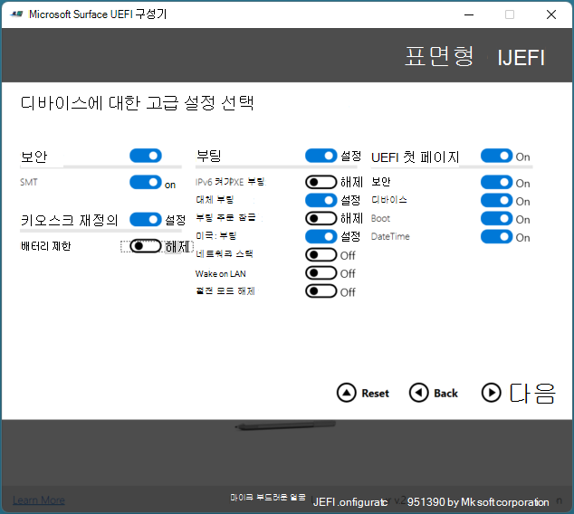

# SEMM을 사용하여 Surface 장치 등록 및 구성Enroll and configure Surface devices with SEMM

Microsoft Surface SEMM(엔터프라이즈 관리 모드)을 사용하면 Surface 디바이스에서 Surface UEFI의 설정을 안전하게 구성하고 조직의 Surface 디바이스에서 이러한 설정을 관리할 수 있습니다.With Microsoft Surface Enterprise Management Mode (SEMM), you can securely configure the settings of Surface UEFI on a Surface device and manage those settings on Surface devices in your organization. Surface 디바이스가 SEMM에 의해 관리되는 경우 해당 \*\* 디바이스는 등록된 것으로 간주됩니다(활성화된 장치라고도 합니다).When a Surface device is managed by SEMM, that device is considered to be *enrolled* (sometimes referred to as activated). 이 문서에서는 Surface UEFI의 설정을 제어할 뿐만 아니라 SEMM에 Surface 디바이스를 등록하는 Surface UEFI 구성 패키지를 만드는 방법을 보여줍니다.This article shows you how to create a Surface UEFI configuration package that will not only control the settings of Surface UEFI, but will also enroll a Surface device in SEMM.

SEMM에 대한 자세한 개요는 Microsoft Surface 엔터프라이즈 관리 [모드를 참조하세요.](https://technet.microsoft.com/itpro/surface/surface-enterprise-management-mode)For a more high-level overview of SEMM, see [Microsoft Surface Enterprise Management Mode](https://technet.microsoft.com/itpro/surface/surface-enterprise-management-mode).

SEMM 대신 새로운 Surface 디바이스는 Microsoft Intune을 통해 펌웨어 설정 하위 집합의 원격 관리를 지원합니다.As an alternative to SEMM, newer Surface devices support remote management of a subset of firmware settings via Microsoft Intune. 자세한 내용은 Surface [UEFI 설정의 Intune 관리를 참조하세요.](surface-manage-dfci-guide.md)For more information,refer to [Intune management of Surface UEFI settings](surface-manage-dfci-guide.md).

> [!NOTE]
> SEMM은 UEFI 관리자를 통해서만 Surface Pro X에서 지원됩니다.SEMM is supported on Surface Pro X via the UEFI Manager only. 자세한 내용은 Surface Pro X 배포, 관리 및 [서비스(Surface Pro X)를 참조하세요.](surface-pro-arm-app-management.md)For more information, refer to [Deploying, managing, and servicing Surface Pro X](surface-pro-arm-app-management.md).

#### Microsoft Surface UEFI 구성기 다운로드 및 설치Download and install Microsoft Surface UEFI Configurator

SEMM 패키지를 만드는 데 사용되는 도구는 Microsoft Surface UEFI Configurator입니다.The tool used to create SEMM packages is Microsoft Surface UEFI Configurator. Microsoft Surface UEFI 구성기는 Microsoft 다운로드 센터의 [Surface Tools for IT](https://www.microsoft.com/download/details.aspx?id=46703) 페이지에서 다운로드할 수 있습니다.You can download Microsoft Surface UEFI Configurator from the [Surface Tools for IT](https://www.microsoft.com/download/details.aspx?id=46703) page in the Microsoft Download Center.
Microsoft Surface UEFI 구성기 Windows Installer(.msi) 파일을 실행하여 도구 설치를 시작하십시오.Run the Microsoft Surface UEFI Configurator Windows Installer (.msi) file to start the installation of the tool. 설치 관리자를 완료하면 시작 메뉴의 모든 앱 섹션에서 Microsoft Surface UEFI Configurator를 찾을 수 있습니다.When the installer completes, find Microsoft Surface UEFI Configurator in the All Apps section of your Start menu.

>[!NOTE]
>Microsoft Surface UEFI 구성기는 Windows 10에서만 지원됩니다.Microsoft Surface UEFI Configurator is supported only on Windows 10.

## Surface UEFI 구성 패키지 만들기Create a Surface UEFI configuration package

Surface UEFI 구성 패키지는 SEMM으로 관리되는 Surface 디바이스에 Surface UEFI 설정의 새 구성을 적용하는 역할과 SEMM에 Surface 디바이스를 등록하는 역할을 모두 수행합니다.The Surface UEFI configuration package performs both the role of applying a new configuration of Surface UEFI settings to a Surface device managed with SEMM and the role of enrolling Surface devices in SEMM. 구성 패키지를 만들려면 각 Surface 디바이스에서 UEFI 설정의 구성을 보호하기 위해 SEMM과 함께 서명 인증서를 사용해야 합니다.The creation of a configuration package requires you to have a signing certificate to be used with SEMM to secure the configuration of UEFI settings on each Surface device. SEMM 인증서의 요구 사항에 대한 자세한 내용은 Microsoft Surface 엔터프라이즈 관리 [모드를 참조하세요.](https://technet.microsoft.com/itpro/surface/surface-enterprise-management-mode)For more information about the requirements for the SEMM certificate, see [Microsoft Surface Enterprise Management Mode](https://technet.microsoft.com/itpro/surface/surface-enterprise-management-mode).

Surface UEFI 구성 패키지를 만들하려면 다음 단계를 수행합니다.To create a Surface UEFI configuration package, follow these steps:

1. 시작 메뉴에서 Microsoft Surface UEFI 구성기 열기Open Microsoft Surface UEFI Configurator from the Start menu.
2. **시작**을 클릭합니다.Click **Start**.
3. 그림 **1과 같이**구성 패키지를 클릭합니다.Click **Configuration Package**, as shown in Figure 1.

   

   *그림 1.Figure 1. 구성 패키지를 선택하여 SEMM 등록 및 구성용 패키지 만들기Select Configuration Package to create a package for SEMM enrollment and configuration*

4. 그림 \*\*\*\* 2와 같이 인증서 보호를 클릭하여 내보낼 인증서 파일을 개인 키(.pfx)로 추가합니다.Click **Certificate Protection** to add your exported certificate file with private key (.pfx), as shown in Figure 2. 인증서 파일의 위치로 이동하여 파일을 선택한 다음 확인을 **클릭합니다.**Browse to the location of your certificate file, select the file, and then click **OK**.

   

   *그림 2.Figure 2. Surface UEFI 구성 패키지에 SEMM 인증서 및 Surface UEFI 암호 추가Add the SEMM certificate and Surface UEFI password to a Surface UEFI configuration package*

5. 인증서 암호를 확인하라는 메시지가 표시되면 인증서 파일의 암호를 입력하고 확인한 다음 확인을 **클릭합니다.**When you are prompted to confirm the certificate password, enter and confirm the password for your certificate file, and then click **OK**.
6. 암호 **보호를 클릭하여** Surface UEFI에 암호를 추가합니다.Click **Password Protection** to add a password to Surface UEFI. 이 암호는 UEFI로 부팅할 때마다 필요합니다.This password will be required whenever you boot to UEFI. 이 암호를 입력하지 않은 경우 **PC** **정보,** 엔터프라이즈 관리 \*\*\*\* 정보 및 종료 페이지만 표시됩니다. \*\*\*\*If this password is not entered, only the **PC information**, **About**, **Enterprise management**, and **Exit** pages will be displayed. 이것은 선택 사항입니다.This step is optional.
7. 메시지가 표시되면 Surface UEFI에 대해 선택한 암호를 입력하고 확인한 다음 확인을 **클릭합니다.**When you are prompted, enter and confirm your chosen password for Surface UEFI, and then click **OK**. 기존 Surface UEFI 암호를 지우고 싶은 경우 암호 필드를 비워 두십시오.If you want to clear an existing Surface UEFI password, leave the password field blank.
8. Surface UEFI 패키지를 특정 장치에 적용하지 못하게 하려는 경우 대상 페이지를 대상으로 할 **Surface** 유형 선택에서 오프 위치에 있도록 해당 Surface Book 또는 \*\*\*\* Surface Pro 4 이미지 아래의 슬라이더를 클릭합니다.If you do not want the Surface UEFI package to apply to a particular device, on the **Choose which Surface type you want to target** page, click the slider beneath the corresponding Surface Book or Surface Pro 4 image so that it is in the **Off** position. 그림 3과 같이(As shown in Figure 3.)
   > [!NOTE] 
   > 기본적으로 선택되어 있는 디바이스는 선택되어 있는 것이 아니라 선택해야 합니다.You must select a device as none are selected by default.

   

   *그림 3.Figure 3. 패키지 호환성을 위해 장치 선택Choose the devices for package compatibility*

9. **다음**을 클릭합니다.Click **Next**.
10. 관리되는 Surface 디바이스에서 구성 요소를 비활성화하려면 페이지에서 활성화하거나 비활성화할 구성 요소 선택에서 비활성화할 장치 또는 장치 그룹 옆의 슬라이더를 클릭하여 슬라이더가 꺼진 **위치에** 있도록 합니다. \*\*\*\*If you want to deactivate a component on managed Surface devices, on the **Choose which components you want to activate or deactivate** page, click the slider next to any device or group of devices you want to deactivate so that the slider is in the **Off** position. (그림 4에 표시) 각 장치에 대한 기본 구성은 **On입니다.**(Shown in Figure 4.) The default configuration for each device is **On**. 모든 \*\*\*\* 슬라이더를 기본 위치로 반환하려면 다시 설정 단추를 클릭합니다.Click the **Reset** button if you want to return all sliders to the default position.

    

    *그림 4.Figure 4. 개별 Surface 구성 요소를 사용하지 않도록 설정하거나 사용하도록 설정Disable or enable individual Surface components*

11. **다음**을 클릭합니다.Click **Next**.
12. Surface UEFI 또는 Surface UEFI 페이지의 표시에서 고급 옵션을 \*\*\*\* 활성화 또는 비활성화하려면 디바이스의 고급 설정 선택 페이지에서 원하는 설정 옆의 \*\*\*\* 슬라이더를 클릭하여 해당 옵션을 설정 또는 해제로 구성합니다(그림 5 참조). \*\*\*\*To enable or disable advanced options in Surface UEFI or the display of Surface UEFI pages, on the **Choose the advanced settings for your devices** page, click the slider beside the desired setting to configure that option to **On** or **Off** (shown in Figure 5). **UEFI** 프런트 페이지 섹션에서 보안, 장치 \*\*\*\* 및 \*\*\*\* 부팅 슬라이더를 사용하여 Surface UEFI로 부팅하는 사용자가 사용할 수 있는 페이지를 제어할 수 있습니다. \*\*\*\*In the **UEFI Front Page** section, you can use the sliders for **Security**, **Devices**, and **Boot** to control what pages are available to users who boot into Surface UEFI. Surface UEFI 설정에 대한 자세한 내용은 [Surface UEFI](https://technet.microsoft.com/itpro/surface/manage-surface-uefi-settings)설정 관리를 참조하세요. **패키지를** 생성하고 저장하는 옵션 선택을 마치면 빌드를 클릭합니다.(For more information about Surface UEFI settings, see [Manage Surface UEFI settings](https://technet.microsoft.com/itpro/surface/manage-surface-uefi-settings).) Click **Build** when you have finished selecting options to generate and save the package.

    

    *그림 5.Figure 5. SEMM을 사용하여 고급 Surface UEFI 설정 및 Surface UEFI 페이지 제어Control advanced Surface UEFI settings and Surface UEFI pages with SEMM*

13. 다른 \*\*\*\* 이름으로 저장 대화 상자에서 Surface UEFI 구성 패키지의 이름을 지정하고 파일을 저장할 위치로 이동한 다음 저장을 **클릭합니다.**In the **Save As** dialog box, specify a name for the Surface UEFI configuration package, browse to the location where you would like to save the file, and then click **Save**.
14. 패키지를 만들어 저장하면 성공 **페이지가** 표시됩니다.When the package is created and saved, the **Successful** page is displayed.

>[!NOTE]
>그림 6과 같이 이 페이지에 표시되는 인증서 지문 문자를 기록합니다.Record the certificate thumbprint characters that are displayed on this page, as shown in Figure 6. SEMM에서 새 Surface 디바이스 등록을 확인하려면 다음 문자가 필요합니다.You will need these characters to confirm enrollment of new Surface devices in SEMM. **종료를** 클릭하여 패키지 만들기를 완료하고 Microsoft Surface UEFI 구성을 닫습니다.Click **End** to complete package creation and close Microsoft Surface UEFI Configurator.

*그림 6.Figure 6. 인증서 지문의 마지막 두 문자가 성공 페이지에 표시됩니다.The last two characters of the certificate thumbprint are displayed on the Successful page*

이제 Surface UEFI 구성 패키지를 만들었다면 Surface 디바이스를 등록하거나 구성할 수 있습니다.Now that you have created your Surface UEFI configuration package, you can enroll or configure Surface devices.

>[!NOTE]
>Surface UEFI 구성 패키지를 만들면 구성 패키지 설정 및 옵션에 대한 세부 정보가 있는 로그 파일이 바탕 화면에 만들어집니다.When a Surface UEFI configuration package is created, a log file is created on the desktop with details of the configuration package settings and options.

## SEMM에 Surface 장치 등록Enroll a Surface device in SEMM
Surface UEFI 구성 패키지가 실행되면 SEMM 인증서 및 Surface UEFI 구성 파일이 Surface 디바이스의 펌웨어 저장소에 준비됩니다.When the Surface UEFI configuration package is executed, the SEMM certificate and Surface UEFI configuration files are staged in the firmware storage of the Surface device. Surface 장치가 다시 시작되면 Surface UEFI는 그림 7에 표시된 같이 이러한 파일을 처리하고 Surface UEFI 구성을 적용하거나 SEMM에 Surface 디바이스를 등록하는 프로세스를 시작됩니다.When the Surface device reboots, Surface UEFI processes these files and begins the process of applying the Surface UEFI configuration or enrolling the Surface device in SEMM, as shown in Figure 7.

*그림 7.Figure 7. Surface UEFI 구성 또는 Surface 디바이스 등록을 위한 SEMM 프로세스The SEMM process for configuration of Surface UEFI or enrollment of a Surface device*

SEMM에서 Surface 디바이스를 등록하는 프로세스를 시작하기 전에 인증서 지문의 마지막 두 문자가 있는지 확인합니다.Before you begin the process to enroll a Surface device in SEMM, ensure that you have the last two characters of the certificate thumbprint on hand. 장치의 등록을 확인하려면 다음 문자가 필요합니다(그림 6 참조).You will need these characters to confirm the device’s enrollment (see Figure 6).

Surface UEFI 구성 패키지를 사용하여 SEMM에 Surface 디바이스를 등록하려면 다음 단계를 수행합니다.To enroll a Surface device in SEMM with a Surface UEFI configuration package, follow these steps:

1. SEMM에 등록하려는 Surface 디바이스에서 Surface UEFI 구성 패키지 .msi 파일을 실행합니다.Run the Surface UEFI configuration package .msi file on the Surface device you want to enroll in SEMM. 그러면 디바이스의 펌웨어에 Surface UEFI 구성 파일이 프로비전됩니다.This will provision the Surface UEFI configuration file in the device’s firmware.
2. EULA(최종 사용자 사용권 계약)에 동의하려면 사용권 계약 확인란의 \*\*\*\* 동의를 선택한 다음 설치를 클릭하여 설치 프로세스를 시작하십시오. \*\*\*\*Select the **I accept the terms in the License Agreement** check box to accept the End User License Agreement (EULA), and then click **Install** to begin the installation process.
3. **Finish를** 클릭하여 Surface UEFI 구성 패키지 설치를 완료하고 설치하라는 메시지가 표시될 때 Surface 디바이스를 다시 시작합니다.Click **Finish** to complete the Surface UEFI configuration package installation and restart the Surface device when you are prompted to do so.
4. Surface UEFI는 구성 파일을 로드하고 장치에서 SEMM이 사용되지 않는지 확인합니다.Surface UEFI will load the configuration file and determine that SEMM is not enabled on the device. 그러면 Surface UEFI에서 다음과 같이 SEMM 등록 프로세스를 시작됩니다.Surface UEFI will then begin the SEMM enrollment process, as follows:
   * Surface UEFI는 SEMM 구성 파일에 SEMM 인증서가 포함되어 있는지를 확인할 것입니다.Surface UEFI will verify that the SEMM configuration file contains a SEMM certificate.
   * Surface UEFI에서는 그림 8과 같이 SEMM에서 Surface 디바이스 등록을 확인하기 위해 인증서 지문의 마지막 두 문자를 입력하라는 메시지가 표시됩니다.Surface UEFI will prompt you to enter the last two characters of the certificate thumbprint to confirm enrollment of the Surface device in SEMM, as shown in Figure 8.

      

      *그림 8.Figure 8. SEMM에 등록하려면 인증서 지문의 마지막 두 문자가 필요합니다.Enrollment in SEMM requires the last two characters of the certificate thumbprint*

   * Surface UEFI는 SEMM 인증서를 펌웨어에 저장하고 Surface UEFI 구성 파일에 지정된 구성 설정을 적용합니다.Surface UEFI will store the SEMM certificate in firmware and apply the configuration settings that are specified in the Surface UEFI configuration file.
   
5. 이제 Surface 디바이스가 SEMM에 등록된 후 Windows로 부팅됩니다.The Surface device is now enrolled in SEMM and will boot to Windows.

프로그램 및 기능의 Microsoft Surface 구성 패키지(그림 9에 표시) \*\*\*\* 또는 이벤트 뷰어의 응용 프로그램 및 서비스 로그 아래에 있는 **Microsoft Surface** \*\*\*\* **UEFI 구성자** 로그에 저장된 이벤트(그림 10에 표시된 것)에서 Surface 디바이스가 SEMM에 성공적으로 등록되어 있는지 확인할 수 있습니다.You can verify that a Surface device has been successfully enrolled in SEMM by looking for **Microsoft Surface Configuration Package** in **Programs and Features** (as shown in Figure 9), or in the events stored in the **Microsoft Surface UEFI Configurator** log, found under **Applications and Services Logs** in Event Viewer (as shown in Figure 10).

*그림 9.Figure 9. 프로그램 및 기능의 SEMM에서 Surface 디바이스 등록 확인Verify the enrollment of a Surface device in SEMM in Programs and Features*

*그림 10.Figure 10. 이벤트 뷰어에서 SEMM에 Surface 디바이스 등록 확인Verify the enrollment of a Surface device in SEMM in Event Viewer*

디바이스가 등록된 동안 Surface UEFI에서 장치가 SEMM에 등록된지 확인할 수 있습니다. Surface \*\*\*\* UEFI에는 엔터프라이즈 관리 페이지가 포함되어 있습니다(그림 11 참조).You can also verify that the device is enrolled in SEMM in Surface UEFI – while the device is enrolled, Surface UEFI will contain the **Enterprise management** page (as shown in Figure 11).

*그림 11.Figure 11. Surface UEFI 엔터프라이즈 관리 페이지The Surface UEFI Enterprise management page*

## SEMM을 사용하여 Surface UEFI 설정 구성Configure Surface UEFI settings with SEMM

장치가 SEMM에 등록된 후 동일한 SEMM 인증서로 서명된 Surface UEFI 구성 패키지를 실행하여 새 Surface UEFI 설정을 적용할 수 있습니다.After a device is enrolled in SEMM, you can run Surface UEFI configuration packages signed with the same SEMM certificate to apply new Surface UEFI settings. 이러한 설정은 다음에 디바이스를 부팅할 때 사용자의 조작 없이 자동으로 적용됩니다.These settings are applied automatically the next time the device boots, without any interaction from the user. Microsoft Endpoint Configuration Manager와 같은 응용 프로그램 배포 솔루션을 사용하여 Surface 디바이스에 Surface UEFI 구성 패키지를 배포하여 Surface UEFI의 설정을 변경하거나 관리할 수 있습니다.You can use application deployment solutions like Microsoft Endpoint Configuration Manager to deploy Surface UEFI configuration packages to Surface devices to change or manage the settings in Surface UEFI.

Configuration Manager를 사용하여 Windows Installer(.msi) 파일을 배포하는 방법에 대한 자세한 내용은 [Microsoft Endpoint Configuration Manager를](https://technet.microsoft.com/library/mt627959)사용하여 응용 프로그램 배포 및 관리를 참조하세요.For more information about how to deploy Windows Installer (.msi) files with Configuration Manager, see [Deploy and manage applications with Microsoft Endpoint Configuration Manager](https://technet.microsoft.com/library/mt627959).

암호로 Surface UEFI를 보호한 경우 암호 없이 Surface UEFI로 부팅을 시도하는 **사용자에게는 PC** **정보,** \*\*\*\* **정보,** 엔터프라이즈 관리 및 종료 페이지만 표시됩니다.If you have secured Surface UEFI with a password, users without the password who attempt to boot to Surface UEFI will only have the **PC information**, **About**, **Enterprise management**, and **Exit** pages displayed to them.

암호로 Surface UEFI를 보호하지 않은 경우 또는 사용자가 암호를 올바르게 입력하면 SEMM으로 구성된 설정이 희미해지며(사용할 수 없음) 조직에서 관리되는 텍스트 일부 설정이 그림 12와 같이 페이지 맨 위에 표시됩니다.If you have not secured Surface UEFI with a password or a user enters the password correctly, settings that are configured with SEMM will be dimmed (unavailable) and the text Some settings are managed by your organization will be displayed at the top of the page, as shown in Figure 12.

*그림 12.Figure 12. Surface UEFI에서 SEMM에 의해 관리되는 설정이 사용하지 않도록 설정됩니다.Settings managed by SEMM will be disabled in Surface UEFI*
