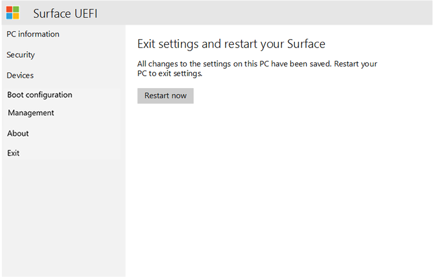

# Surface UEFI 설정 관리Manage Surface UEFI settings

모든 현재 및 미래의 Surface 디바이스는 Microsoft에서 이러한 장치를 위해 특별히 설계된 고유한 UEFI(Unified Extensible Firmware Interface)를 사용합니다.All current and future generations of Surface devices use a unique Unified Extensible Firmware Interface (UEFI) engineered by Microsoft specifically for these devices. Surface UEFI 설정은 기본 제공 장치 및 구성 요소를 활성화 또는 비활성화하고, UEFI 설정이 변경되지 않도록 보호하고, Surface 디바이스 부팅 설정을 조정하는 기능을 제공합니다.Surface UEFI settings provide the ability to enable or disable built-in devices and components, protect UEFI settings from being changed, and adjust the Surface device boot settings. 

## 지원되는 제품Supported products

UEFI 관리는 다음에서 지원됩니다.UEFI management is supported on the following: 

- Surface Pro 4, Surface Pro(5세대), Surface Pro 6, Surface Pro 7, Surface Pro 7+, Surface Pro XSurface Pro 4, Surface Pro (5th Gen), Surface Pro 6, Surface Pro 7, Surface Pro 7+, Surface Pro X
- Surface 노트북(1세대), Surface 노트북 2, Surface 노트북 3, Surface 노트북 이동Surface Laptop (1st Gen), Surface Laptop 2, Surface Laptop 3, Surface Laptop Go
- Surface Studio(1세대), Surface Studio 2Surface Studio (1st Gen), Surface Studio 2
- Surface Book, Surface Book 2, Surface Book 3Surface Book, Surface Book 2, Surface Book 3
- Surface Go, Surface Go 2Surface Go, Surface Go 2

## 클라우드 기반 관리 지원Support for cloud-based management

Microsoft Intune에 기본 제공되는 DFCI(장치 펌웨어 구성 인터페이스) 프로필을 사용하여(공개 미리 보기에서 사용 가능) Surface UEFI 관리는 최신 관리 스택을 UEFI 하드웨어 수준으로 확장합니다.With Device Firmware Configuration Interface (DFCI) profiles built into Microsoft Intune (now available in public preview), Surface UEFI management extends the modern management stack down to the UEFI hardware level. DFCI는 제로 터치 프로비전을 지원하고, BIOS 암호를 제거하고, 부팅 옵션 및 기본 제공 주변 장치를 비롯한 보안 설정을 제어하며, 향후 고급 보안 시나리오를 위한 초안을 마련합니다.DFCI supports zero-touch provisioning, eliminates BIOS passwords, provides control of security settings including boot options and built-in peripherals, and lays the groundwork for advanced security scenarios in the future. DFCI는 현재 Surface Pro 7+, Surface Laptop Go, Surface Book 3, Surface Laptop 3, Surface Pro 7 및 Surface Pro X에 사용할 수 있습니다.  자세한 내용은 Surface [UEFI 설정의 Intune 관리를 참조하세요.](surface-manage-dfci-guide.md)DFCI is currently available for Surface Pro 7+, Surface Laptop Go, Surface Book 3, Surface Laptop 3, Surface Pro 7, and Surface Pro X.  For more information, refer to [Intune management of Surface UEFI settings](surface-manage-dfci-guide.md).

## Surface UEFI 메뉴 열기Open Surface UEFI menu

시스템 시작 중에 UEFI 설정을 조정하려면To adjust UEFI settings during system startup:

1. Surface를 종료하고 꺼지기 위해 10초 정도 기다립니다.Shut down your Surface and wait about 10 seconds to make sure it's off.
2. 볼륨 업 단추를 **누르고** 동시에 전원 단추를 **누르고 해제합니다.**Press and hold the **Volume-up** button  and - at the same time - press and release the **Power button.**
3. 화면에 Microsoft 또는 Surface 로고가 표시될 때 \*\*\*\* UEFI 화면이 나타날 때까지 볼륨 업 단추를 계속 누릅니다.As the Microsoft or Surface logo appears on your screen, continue to hold the **Volume-up** button until the UEFI screen appears.

## UEFI PC 정보 페이지UEFI PC information page

PC 정보 페이지에는 Surface 디바이스에 대한 자세한 정보가 포함되어 있습니다.The PC information page includes detailed information about your Surface device: 

- **Model** – Surface Book 2 또는 Surface Pro 7과 같이 Surface 디바이스의 모델이 여기에 표시됩니다.**Model** – Your Surface device’s model will be displayed here, such as Surface Book 2 or Surface Pro 7. 프로세서, 디스크 크기, 메모리 크기와 같은 정확한 디바이스 구성은 표시되지 않습니다.The exact configuration of your device is not shown, (such as processor, disk size, or memory size). 
- **UUID** – 이 Universally Unique Identifier 번호는 디바이스별로 고유하며, 배포 또는 관리하는 동안 디바이스를 식별하는 데 사용됩니다.**UUID** – This Universally Unique Identification number is specific to your device and is used to identify the device during deployment or management. 

- **일련 번호** - 이 번호는 자산 태깅 및 지원 시나리오에서 이 특정 Surface 디바이스를 식별하는 데 사용됩니다.**Serial Number** – This number is used to identify this specific Surface device for asset tagging and support scenarios.
- **자산 태그** – 자산 태그는 [자산 태그 도구](https://docs.microsoft.com/surface/assettag)를 사용하여 Surface 디바이스에 할당됩니다.**Asset Tag** – The asset tag is assigned to the Surface device with the [Asset Tag Tool](https://docs.microsoft.com/surface/assettag). 

Surface 디바이스의 펌웨어에 대한 자세한 정보도 확인할 수 있습니다.You will also find detailed information about the firmware of your Surface device. Surface 디바이스에는 각각 다른 버전의 펌웨어를 실행하는 몇 가지 내부 구성 요소가 있습니다.Surface devices have several internal components that each run different versions of firmware. 다음 디바이스 각각의 펌웨어 버전은 **PC 정보** 페이지에 표시됩니다(그림 1 참조).The firmware version of each of the following devices is displayed on the **PC information** page (as shown in Figure 1): 

- 시스템 UEFISystem UEFI 

- SAM 컨트롤러SAM Controller 

- Intel 관리 엔진Intel Management Engine 

- 시스템 포함 컨트롤러System Embedded Controller 

- 터치 펌웨어Touch Firmware 

*그림 1.Figure 1. 시스템 정보 및 펌웨어 버전 정보System information and firmware version information*

Surface 디바이스의 최신 펌웨어 버전에 대한 최신 정보는 디바이스의 [Surface 업데이트 기록](https://www.microsoft.com/surface/support/install-update-activate/surface-update-history)에서 확인할 수 있습니다.You can find up-to-date information about the latest firmware version for your Surface device in the [Surface Update History](https://www.microsoft.com/surface/support/install-update-activate/surface-update-history) for your device. 

## UEFI 보안 페이지UEFI Security page 

*그림 2.Figure 2. Surface UEFI 보안 설정 구성Configure Surface UEFI security settings*

보안 페이지에서는 암호를 설정하여 UEFI 설정을 보호할 수 있습니다.The Security page allows you to set a password to protect UEFI settings. Surface 디바이스를 UEFI로 부팅할 때 이 암호를 입력해야 합니다.This password must be entered when you boot the Surface device to UEFI. 그림 3과 같이 암호에는 다음 문자가 포함될 수 있습니다.The password can contain the following characters (as shown in Figure 3): 

- 대문자: A-ZUppercase letters: A-Z 

- 소문자: a-zLowercase letters: a-z 

- 숫자: 1-0Numbers: 1-0 

- 특수 문자: !@#$%^&\*()?<>{} []-_=+|.,;:''"Special characters: !@#$%^&\*()?<>{}[]-_=+|.,;:’\`” 

암호는 6자 이상이어야 하며 대/소문자를 구분합니다.The password must be at least 6 characters and is case sensitive. 

*그림 3.Figure 3. Surface UEFI 설정 보호를 위해 암호 추가Add a password to protect Surface UEFI settings*

보안 페이지에서 Surface 디바이스에 대한 보안 부팅 구성을 변경할 수도 있습니다.On the Security page you can also change the configuration of Secure Boot on your Surface device. 보안 부팅 기술은 무단 부팅 코드가 Surface 디바이스에서 부팅되는 문제를 방지하여 bootkit 및 루트킷 형식의 맬웨어 감염으로부터 보호합니다.Secure Boot technology prevents unauthorized boot code from booting on your Surface device, which protects against bootkit and rootkit-type malware infections. Surface 디바이스에서 타사 운영 체제 또는 부팅 가능한 미디어를 허용하기 위해 보안 부팅을 사용하지 않도록 설정할 수 있습니다.You can disable Secure Boot to allow your Surface device to boot third-party operating systems or bootable media. 그림 4와 같이 타사 인증서에서 작동하도록 보안 부팅을 구성할 수 있습니다.You can also configure Secure Boot to work with third-party certificates, as shown in Figure 4. TechNet 라이브러리에서 [보안 부팅](https://msdn.microsoft.com/windows/hardware/commercialize/manufacture/desktop/secure-boot-overview)에 대해 자세히 알아보세요.Read more about [Secure Boot](https://msdn.microsoft.com/windows/hardware/commercialize/manufacture/desktop/secure-boot-overview) in the TechNet Library.

*그림 4.Figure 4. 보안 부팅 구성Configure Secure Boot*

장치에 따라 TPM이 활성화 또는 비활성화되어 있는지 여부도 볼 수 있습니다.Depending on your device, you may also be able to see if your TPM is enabled or disabled. **TPM** 사용 설정이 없는 경우 그림 5와 같이 Windows에서 tpm.msc를 열고 상태를 검사합니다.If you do not see the **Enable TPM**  setting, open tpm.msc in Windows to check the status, as shown in Figure 5. TPM은 BitLocker로 디바이스 데이터에 대한 암호화를 인증하는 데 사용됩니다.The TPM is used to authenticate encryption for your device’s data with BitLocker. 자세한 내용은 [BitLocker 개요를 참조하세요.](https://docs.microsoft.com/windows/security/information-protection/bitlocker/bitlocker-overview)To learn more, see [BitLocker overview](https://docs.microsoft.com/windows/security/information-protection/bitlocker/bitlocker-overview). 

*그림 5.Figure 5. TPM 콘솔TPM console*

## UEFI 메뉴: 장치UEFI menu: Devices 

장치 페이지에서는 다음을 비롯한 특정 장치 및 구성 요소를 활성화 또는 비활성화할 수 있습니다.The Devices page allows you to  enable or disable specific devices and components including:

- 도킹 및 USB 포트Docking and USB Ports 

- MicroSD 또는 SD 카드 슬롯MicroSD or SD Card Slot 

- 후면 카메라Rear Camera 

- 전면 카메라Front Camera 

- IR(적외선) 카메라Infrared (IR) Camera 

- Wi-Fi 및 BluetoothWi-Fi and Bluetooth 

- 온보드 오디오(스피커 및 마이크)Onboard Audio (Speakers and Microphone) 

그림 6과 같이 각 디바이스에는 설정(사용) 또는 \*\*\*\* 해제(비활성화) 위치로 이동할 수 있는 슬라이더 단추가 표시됩니다. \*\*\*\*Each device is listed with a slider button that you can move to **On** (enabled) or **Off** (disabled) position, as shown in Figure 6. 

*그림 6.Figure 6. 특정 디바이스를 사용하거나 사용하지 않도록 설정Enable and disable specific devices*

## UEFI 메뉴: 부팅 구성UEFI menu: Boot configuration 

부팅 구성 페이지에서는 부팅 디바이스의 순서를 변경하고 다음 디바이스의 부팅을 활성화 또는 비활성화할 수 있습니다.The Boot Configuration page allows you to change the order of your boot devices as well as enable or disable boot of the following devices: 

- Windows 부팅 관리자Windows Boot Manager 

- USB 저장소USB Storage 

- PXE 네트워크PXE Network 

- 내부 저장소Internal Storage 

특정 디바이스에서 즉시 부팅할 수도 있고, 터치 스크린을 사용하여 목록에서 해당 디바이스 항목을 왼쪽으로 살짝 밀 수도 있습니다.You can boot from a specific device immediately, or you can swipe left on that device’s entry in the list using the touchscreen. 또한 Surface 디바이스 전원이 꺼질 때 **볼륨 작게** 단추 및 **전원** 단추를 동시에 눌러 USB 디바이스 또는 USB 이더넷 어댑터로 즉시 부팅할 수도 있습니다.You can also boot immediately to a USB device or USB Ethernet adapter when the Surface device is powered off by pressing the **Volume Down** button and the **Power** button simultaneously. 

지정된 부팅 순서를 적용하려면 그림 7과 같이 대체 부팅 시퀀스 사용 옵션을 **On으로**설정해야 합니다. \*\*\*\*For the specified boot order to take effect, you must set the **Enable Alternate Boot Sequence** option to **On**, as shown in Figure 7. 

*그림 7.Figure 7. Surface 디바이스에 대한 부팅 순서 구성Configure the boot order for your Surface device* 

예를 들어 PXE를 사용하여 Windows 배포를 수행하는 경우(여기서 PXE 서버는 IPv4 전용으로 구성됨) **Enable IPv6 for PXE Network Boot**(PXE 네트워크 부팅을 위해 IPv6 사용) 옵션을 사용하여 PXE용 IPv6 지원을 켜거나 끌 수도 있습니다.You can also turn on and off IPv6 support for PXE with the **Enable IPv6 for PXE Network Boot** option, for example when performing a Windows deployment using PXE where the PXE server is configured for IPv4 only.  

## UEFI 메뉴: 관리UEFI menu: Management
관리 페이지에서는 Surface Pro 7, Surface Pro X 및 Surface Laptop 3을 비롯한 적합한 장치에서 제로 터치 UEFI 관리 및 기타 기능 사용을 관리할 수 있습니다.The Management page allows you to manage use of Zero Touch UEFI Management and other features on eligible devices including Surface Pro 7, Surface Pro X, and Surface Laptop 3.  

 *관리합니다. 그림 8. 제로 터치 UEFI 관리 및 기타* 기능에 대한 액세스 관리Manage access to Zero Touch UEFI Management and other features](images/manage-surface-uefi-fig7a.png "Manage access to Zero Touch UEFI Management and other features")
*Figure 8. Manage access to Zero Touch UEFI Management and other features* 

제로 터치 UEFI 관리를 사용하면 DFCI(장치 펌웨어 구성 인터페이스)라는 Intune 내의 장치 프로필을 사용하여 UEFI 설정을 원격으로 관리할 수 있습니다.Zero Touch UEFI Management lets you remotely manage UEFI settings  by using a device profile within Intune called Device Firmware Configuration Interface (DFCI). 이 설정을 구성하지 않는 경우 DFCI를 사용하여 적합한 장치를 관리할 수 있는 능력이 Ready로 **설정됩니다.**If you do not configure this setting, the ability to manage eligible devices with DFCI is set to **Ready**. DFCI를 방지하려면 **옵트아웃을 선택합니다.**To prevent DFCI, select **Opt-Out**. 

> [!NOTE]
> UEFI 관리 설정 페이지 및 DFCI 사용은 현재 Surface Pro 7+, Surface Laptop Go, Surface Book 3, Surface Laptop 3, Surface Pro 7 및 Surface Pro X에 사용할 수 있습니다. 자세한 내용은 [Surface UEFI 설정의 Intune 관리를 참조하세요.](surface-manage-dfci-guide.md)The UEFI Management settings page and use of DFCI is currently available for Surface Pro 7+, Surface Laptop Go, Surface Book 3, Surface Laptop 3, Surface Pro 7, and Surface Pro X. To learn more, see [Intune management of Surface UEFI settings](surface-manage-dfci-guide.md).

## UEFI 메뉴: 종료UEFI menu: Exit 

그림 9와 같이 \*\*\*\* 종료 **페이지의** 지금 다시 시작 단추를 사용하여 UEFI 설정을 종료합니다.Use the **Restart Now** button on the **Exit** page to exit UEFI settings, as shown in Figure 9. 

*그림 9.Figure 9. 지금 다시 시작을 클릭하여 UEFI 화면을 종료하고 디바이스를 다시 시작Click Restart Now to exit Surface UEFI and restart the device*

## Surface UEFI 부팅 화면Surface UEFI boot screens

Surface 디바이스 펌웨어를 업데이트할 때 Windows 업데이트나 수동 설치를 사용하여 업데이트가 디바이스에 즉시 적용되지 않고 다음 다시 부팅 주기 동안 적용됩니다.When you update Surface device firmware, by using either Windows Update or manual installation, the updates are not applied immediately to the device, but instead during the next reboot cycle. Surface 펌웨어 업데이트 프로세스에 대한 자세한 내용은 [Surface 드라이버 및 펌웨어 업데이트 관리](https://docs.microsoft.com/surface/manage-surface-pro-3-firmware-updates)를 참조하세요.You can find out more about the Surface firmware update process in [Manage Surface driver and firmware updates](https://docs.microsoft.com/surface/manage-surface-pro-3-firmware-updates). 펌웨어 업데이트 진행률이 화면에 표시되고 진행률 표시줄은 각 구성 요소의 펌웨어를 나타내는 여러 색으로 구성됩니다.The progress of the firmware update is displayed on a screen with progress bars of differing colors to indicate the firmware for each component. 그림 9에서 18까지의 그림에는 각 구성 요소의 진행률 표시줄이 나와 있습니다.Each component’s progress bar is shown in Figures 9 through 18.

*그림 10.Figure 10. 파랑 진행률 표시줄이 표시된 Surface UEFI 펌웨어 업데이트The Surface UEFI firmware update displays a blue progress bar*

*그림 11.Figure 11. 녹색 진행률 표시줄이 표시된 시스템 포함 컨트롤러 펌웨어The System Embedded Controller firmware update displays a green progress bar*

*그림 12.Figure 12. 주황색 진행률 표시줄이 표시된 SAM 컨트롤러 펌웨어 업데이트The SAM Controller firmware update displays an orange progress bar*

*그림 13.Figure 13. 빨강 진행률 표시줄이 표시된 Intel 관리 엔진 펌웨어 업데이트The Intel Management Engine firmware update displays a red progress bar*

*그림 14.Figure 14. 회색 진행률 표시줄이 표시된 Surface 터치 펌웨어 업데이트The Surface touch firmware update displays a gray progress bar*

*그림 15.Figure 15. Surface KIP 펌웨어 업데이트에 밝은 녹색 진행률 표시줄이 표시됩니다.The Surface KIP firmware update displays a light green progress bar*

*그림 16 Surface ISH 펌웨어 업데이트에 밝은 분홍색 진행률 표시줄이 표시됩니다.Figure 16 The Surface ISH firmware update displays a light pink progress bar*

*그림 17.Figure 17. Surface Trackpad 펌웨어 업데이트에 분홍색 진행률 표시줄이 표시됩니다.The Surface Trackpad firmware update displays a pink progress bar*

*그림 18.Figure 18. Surface TCON 펌웨어 업데이트에 밝은 회색 진행률 표시줄이 표시됩니다.The Surface TCON firmware update displays a light gray progress bar*

*그림 19.Figure 19. Surface TPM 펌웨어 업데이트에 자주색 진행률 표시줄이 표시됩니다.The Surface TPM firmware update displays a purple progress bar*

>[!NOTE]
>그림 19에 표시된 같이 보안 부팅이 사용되지 않도록 설정되어 있는 경우를 나타내는 추가 경고 메시지가 표시됩니다.An additional warning message that indicates Secure Boot is disabled is displayed, as shown in Figure 19.

*그림 20.Figure 20. Surface UEFI 설정에서 보안 부팅이 사용하지 않도록 설정되었음을 나타내는 Surface 부팅 화면Surface boot screen that indicates Secure Boot has been disabled in Surface UEFI settings*

## 관련 항목Related topics

- [Surface UEFI 설정의 Intune 관리Intune management of Surface UEFI settings](surface-manage-dfci-guide.md)

-  [Surface Enterprise 관리 모드Surface Enterprise Management Mode](surface-enterprise-management-mode.md)
