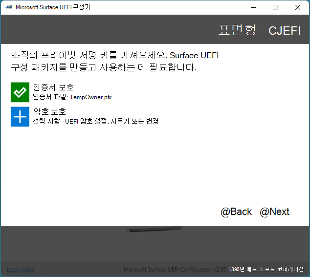
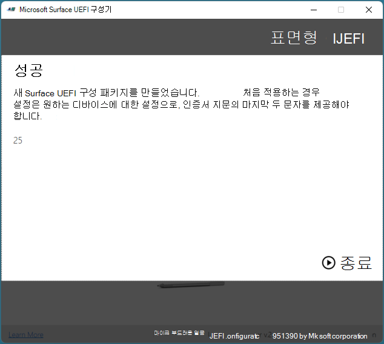

# <span data-ttu-id="2fbe3-104">Microsoft Surface Enterprise 관리 모드</span><span class="sxs-lookup"><span data-stu-id="2fbe3-104">Microsoft Surface Enterprise Management Mode</span></span>

<span data-ttu-id="2fbe3-105">Microsoft Surface Enterprise 관리 모드 (SEMM)는 조직 내에서 펌웨어 설정을 보호 하 고 관리 하는 데 사용할 수 있는 surface UEFI를 사용 하는 Surface 디바이스의 기능입니다.</span><span class="sxs-lookup"><span data-stu-id="2fbe3-105">Microsoft Surface Enterprise Management Mode (SEMM) is a feature of Surface devices with Surface UEFI that allows you to secure and manage firmware settings within your organization.</span></span> <span data-ttu-id="2fbe3-106">SEMM을 사용 하면 IT 전문가는 UEFI 설정의 구성을 준비 하 고 Surface 장치에 설치할 수 있습니다.</span><span class="sxs-lookup"><span data-stu-id="2fbe3-106">With SEMM, IT professionals can prepare configurations of UEFI settings and install them on a Surface device.</span></span> <span data-ttu-id="2fbe3-107">SEMM은 UEFI 설정을 구성 하는 기능 외에도 인증서를 사용 하 여 무단 무단 변경 또는 제거 로부터 구성을 보호 합니다.</span><span class="sxs-lookup"><span data-stu-id="2fbe3-107">In addition to the ability to configure UEFI settings, SEMM also uses a certificate to protect the configuration from unauthorized tampering or removal.</span></span>

>[!NOTE]
><span data-ttu-id="2fbe3-108">SEMM은 Surface UEFI 펌웨어가 있는 디바이스 에서만 사용할 수 있습니다.</span><span class="sxs-lookup"><span data-stu-id="2fbe3-108">SEMM is only available on devices with Surface UEFI firmware.</span></span> <span data-ttu-id="2fbe3-109">여기에는 인텔 프로세서와 함께 Surface Pro 7, Surface Pro X 및 Surface 랩탑 3 상업용 Sku를 비롯 한 대부분의 Surface 장치가 포함 됩니다.</span><span class="sxs-lookup"><span data-stu-id="2fbe3-109">This includes most Surface devices including Surface Pro 7, Surface Pro X, and Surface Laptop 3 commercial SKUs with an Intel processor.</span></span> <span data-ttu-id="2fbe3-110">15 "Surface 랩탑 3 SKU (AMD 프로세서 포함)에서 지원 되지 않습니다 (정품 SKU로 서만 제공).</span><span class="sxs-lookup"><span data-stu-id="2fbe3-110">SEMM is not supported on the 15" Surface Laptop 3 SKU with AMD processor (only available as a retail SKU).</span></span> 

<span data-ttu-id="2fbe3-111">Surface 디바이스는 SEMM로 구성 되 고 SEMM 인증서로 보호 되는 경우 SEMM로 *등록* 된 것으로 간주 됩니다.</span><span class="sxs-lookup"><span data-stu-id="2fbe3-111">When Surface devices are configured by SEMM and secured with the SEMM certificate, they are considered *enrolled* in SEMM.</span></span> <span data-ttu-id="2fbe3-112">SEMM 인증서가 제거 되 고 UEFI 설정의 제어가 장치 사용자에 게 반환 되는 경우 Surface 디바이스는 *unenrolled* 로 간주 됩니다.</span><span class="sxs-lookup"><span data-stu-id="2fbe3-112">When the SEMM certificate is removed and control of UEFI settings is returned to the user of the device, the Surface device is considered *unenrolled* in SEMM.</span></span>

<span data-ttu-id="2fbe3-113">SEMM 및 등록 된 Surface 디바이스를 관리 하는 데 사용할 수 있는 두 가지 관리 옵션으로 독립 실행형 도구 또는 Microsoft 끝점 구성 관리자와의 통합이 있습니다.</span><span class="sxs-lookup"><span data-stu-id="2fbe3-113">There are two administrative options you can use to manage SEMM and enrolled Surface devices – a standalone tool or integration with Microsoft Endpoint Configuration Manager.</span></span> <span data-ttu-id="2fbe3-114">이 문서에서는 Microsoft Surface UEFI 구성자 이라고 하는 모든 독립 실행형 도구에 대해 설명 합니다.</span><span class="sxs-lookup"><span data-stu-id="2fbe3-114">The SEMM standalone tool, called the Microsoft Surface UEFI Configurator, is described in this article.</span></span> <span data-ttu-id="2fbe3-115">Microsoft Endpoint Configuration Manager에서 SEMM을 관리 하는 방법에 대 한 자세한 내용은 [Microsoft Endpoint Configuration manager를 사용 하 여 디바이스 관리 (SEMM](https://technet.microsoft.com/itpro/surface/use-system-center-configuration-manager-to-manage-devices-with-semm))를 참조 하세요.</span><span class="sxs-lookup"><span data-stu-id="2fbe3-115">For more information about how to manage SEMM with Microsoft Endpoint Configuration Manager, see [Use Microsoft Endpoint Configuration Manager to manage devices with SEMM](https://technet.microsoft.com/itpro/surface/use-system-center-configuration-manager-to-manage-devices-with-semm).</span></span>


## <span data-ttu-id="2fbe3-116">Microsoft Surface UEFI 구성자</span><span class="sxs-lookup"><span data-stu-id="2fbe3-116">Microsoft Surface UEFI Configurator</span></span>

<span data-ttu-id="2fbe3-117">그림 1에 나와 있는 것 처럼 SEMM의 기본 작업 영역은 Microsoft Surface UEFI 구성자입니다.</span><span class="sxs-lookup"><span data-stu-id="2fbe3-117">The primary workspace of SEMM is Microsoft Surface UEFI Configurator, as shown in Figure 1.</span></span> <span data-ttu-id="2fbe3-118">Microsoft Surface UEFI 구성자는 Surface 장치에서 SEMM을 등록, 구성 및 등록 해제 하는 데 사용 되는 Windows Installer (.msi) 패키지 또는 WinPE 이미지를 만드는 데 사용 되는 도구입니다.</span><span class="sxs-lookup"><span data-stu-id="2fbe3-118">Microsoft Surface UEFI Configurator is a tool that is used to create Windows Installer (.msi) packages or WinPE images that are used to enroll, configure, and unenroll SEMM on a Surface device.</span></span> <span data-ttu-id="2fbe3-119">이러한 패키지에는 UEFI에 대 한 설정을 지정 하는 구성 파일이 포함 되어 있습니다.</span><span class="sxs-lookup"><span data-stu-id="2fbe3-119">These packages contain a configuration file where the settings for UEFI are specified.</span></span> <span data-ttu-id="2fbe3-120">SEMM 패키지에는 또한 펌웨어에서 설치 및 저장 되며 UEFI 설정이 적용 되기 전에 구성 파일의 서명을 확인 하는 데 사용 되는 인증서가 포함 되어 있습니다.</span><span class="sxs-lookup"><span data-stu-id="2fbe3-120">SEMM packages also contain a certificate that is installed and stored in firmware and used to verify the signature of configuration files before UEFI settings are applied.</span></span>

>[!NOTE]
><span data-ttu-id="2fbe3-121">이제 Surface UEFI 구성자 및 SEMM을 사용 하 여 Surface Dock 2의 포트를 관리할 수 있습니다.</span><span class="sxs-lookup"><span data-stu-id="2fbe3-121">You can now use Surface UEFI Configurator and SEMM to manage ports on Surface Dock 2.</span></span> <span data-ttu-id="2fbe3-122">자세한 내용은 [SEMM의 보안 Surface Dock 2 포트](secure-surface-dock-ports-semm.md)를 참조 하세요.</span><span class="sxs-lookup"><span data-stu-id="2fbe3-122">To learn more, see [Secure Surface Dock 2 ports with SEMM](secure-surface-dock-ports-semm.md).</span></span>


*<span data-ttu-id="2fbe3-124">그림 1.</span><span class="sxs-lookup"><span data-stu-id="2fbe3-124">Figure 1.</span></span> <span data-ttu-id="2fbe3-125">Microsoft Surface UEFI 구성자</span><span class="sxs-lookup"><span data-stu-id="2fbe3-125">Microsoft Surface UEFI Configurator</span></span>*


<span data-ttu-id="2fbe3-126">다음 세 가지 모드에서 Microsoft Surface UEFI 구성자 도구를 사용할 수 있습니다.</span><span class="sxs-lookup"><span data-stu-id="2fbe3-126">You can use the Microsoft Surface UEFI Configurator tool in three modes:</span></span>

* <span data-ttu-id="2fbe3-127">[SURFACE UEFI 구성 패키지](#configuration-package)입니다.</span><span class="sxs-lookup"><span data-stu-id="2fbe3-127">[Surface UEFI Configuration Package](#configuration-package).</span></span> <span data-ttu-id="2fbe3-128">이 모드를 사용 하 여 surface UEFI 구성 패키지를 만들어 surface device를 SEMM에 등록 하 고 등록 된 디바이스에서 UEFI 설정을 구성할 수 있습니다.</span><span class="sxs-lookup"><span data-stu-id="2fbe3-128">Use this mode to create a Surface UEFI configuration package to enroll a Surface device in SEMM and to configure UEFI settings on enrolled devices.</span></span>
* <span data-ttu-id="2fbe3-129">[SURFACE UEFI Reset 패키지](#reset-package)입니다.</span><span class="sxs-lookup"><span data-stu-id="2fbe3-129">[Surface UEFI Reset Package](#reset-package).</span></span> <span data-ttu-id="2fbe3-130">이 모드를 사용 하 여 Surface 디바이스의 등록을 SEMM로 등록 해제 합니다.</span><span class="sxs-lookup"><span data-stu-id="2fbe3-130">Use this mode to unenroll a Surface device from SEMM.</span></span>
* <span data-ttu-id="2fbe3-131">[SURFACE UEFI 복구 요청](#recovery-request)입니다.</span><span class="sxs-lookup"><span data-stu-id="2fbe3-131">[Surface UEFI Recovery Request](#recovery-request).</span></span> <span data-ttu-id="2fbe3-132">패키지 다시 설정 작업이 실패 하는 경우이 모드를 사용 하 여 복구 요청에 응답 하 여 Surface device를 SEMM에서 등록 해제 합니다.</span><span class="sxs-lookup"><span data-stu-id="2fbe3-132">Use this mode to respond to a recovery request to unenroll a Surface device from SEMM where a Reset Package operation is not successful.</span></span>


#### <span data-ttu-id="2fbe3-133">Microsoft Surface UEFI 구성자 다운로드</span><span class="sxs-lookup"><span data-stu-id="2fbe3-133">Download Microsoft Surface UEFI Configurator</span></span>

<span data-ttu-id="2fbe3-134">Microsoft Surface UEFI Configurator를 다운로드 센터의 IT 페이지의 [Surface Tools](https://www.microsoft.com/download/details.aspx?id=46703) 에서 다운로드할 수 있습니다.</span><span class="sxs-lookup"><span data-stu-id="2fbe3-134">You can download Microsoft Surface UEFI Configurator from the [Surface Tools for IT](https://www.microsoft.com/download/details.aspx?id=46703) page in the Microsoft Download Center.</span></span>

### <span data-ttu-id="2fbe3-135">구성 패키지</span><span class="sxs-lookup"><span data-stu-id="2fbe3-135">Configuration package</span></span>

<span data-ttu-id="2fbe3-136">Surface UEFI 구성 패키지는 Surface 디바이스의 SEMM을 구현 하 고 관리 하는 기본 메커니즘입니다.</span><span class="sxs-lookup"><span data-stu-id="2fbe3-136">Surface UEFI configuration packages are the primary mechanism to implement and manage SEMM on Surface devices.</span></span> <span data-ttu-id="2fbe3-137">이러한 패키지에는 그림 2와 같이 Microsoft Surface UEFI 구성자 및 인증서 파일에 패키지를 만드는 동안 지정 된 UEFI 설정의 구성 파일이 포함 됩니다.</span><span class="sxs-lookup"><span data-stu-id="2fbe3-137">These packages contain a configuration file of UEFI settings specified during creation of the package in Microsoft Surface UEFI Configurator and a certificate file, as shown in Figure 2.</span></span> <span data-ttu-id="2fbe3-138">SEMM에 등록 되지 않은 Surface 장치에서 처음으로 구성 패키지를 실행 하는 경우 디바이스 펌웨어의 인증서 파일을 프로 비전 하 고이 장치를 SEMM에 등록할 수 있습니다.</span><span class="sxs-lookup"><span data-stu-id="2fbe3-138">When a configuration package is run for the first time on a Surface device that is not already enrolled in SEMM, it provisions the certificate file in the device’s firmware and enrolls the device in SEMM.</span></span> <span data-ttu-id="2fbe3-139">SEMM에서 디바이스를 등록 하는 경우 인증서 파일을 저장 하기 전에 SEMM 인증서 손도장의 마지막 두 자리를 제공 하 고 등록을 완료 하 라는 메시지가 표시 됩니다.</span><span class="sxs-lookup"><span data-stu-id="2fbe3-139">When enrolling a device in SEMM, you will be prompted to confirm the operation by providing the last two digits of the SEMM certificate thumbprint before the certificate file is stored and the enrollment can complete.</span></span> <span data-ttu-id="2fbe3-140">이 확인을 위해서는 등록할 때 장치에 사용자가 있어야 확인을 수행할 수 있습니다.</span><span class="sxs-lookup"><span data-stu-id="2fbe3-140">This confirmation requires that a user be present at the device at the time of enrollment to perform the confirmation.</span></span>



*<span data-ttu-id="2fbe3-142">그림 2.</span><span class="sxs-lookup"><span data-stu-id="2fbe3-142">Figure 2.</span></span> <span data-ttu-id="2fbe3-143">인증서를 사용 하 여 SEMM 구성 패키지 보호</span><span class="sxs-lookup"><span data-stu-id="2fbe3-143">Secure a SEMM configuration package with a certificate</span></span>*

<span data-ttu-id="2fbe3-144">SEMM 인증서에 대 한 요구 사항에 대 한 자세한 내용은이 문서의 [Surface Enterprise 관리 모드 인증서 요구 사항](#surface-enterprise-management-mode-certificate-requirements) 섹션을 참조 하세요.</span><span class="sxs-lookup"><span data-stu-id="2fbe3-144">See the [Surface Enterprise Management Mode certificate requirements](#surface-enterprise-management-mode-certificate-requirements) section of this article for more information about the requirements for the SEMM certificate.</span></span>

>[!NOTE]
><span data-ttu-id="2fbe3-145">Surface UEFI의 **보안**, **장치**, **부팅 구성**또는 **엔터프라이즈 관리** 페이지를 보는 데 필요한 semm의 암호를 지정할 수도 있습니다.</span><span class="sxs-lookup"><span data-stu-id="2fbe3-145">You can also specify a UEFI password with SEMM that is required to view the **Security**, **Devices**, **Boot Configuration**, or **Enterprise Management** pages of Surface UEFI.</span></span>

<span data-ttu-id="2fbe3-146">디바이스가 SEMM에 등록 되 면 구성 파일을 읽고 파일에 지정 된 설정이 UEFI에 적용 됩니다.</span><span class="sxs-lookup"><span data-stu-id="2fbe3-146">After a device is enrolled in SEMM, the configuration file is read and the settings specified in the file are applied to UEFI.</span></span> <span data-ttu-id="2fbe3-147">SEMM로 등록 된 장치에서 구성 패키지를 실행 하는 경우 구성 파일의 서명이 디바이스 펌웨어에 저장 된 인증서를 기준으로 검사 됩니다.</span><span class="sxs-lookup"><span data-stu-id="2fbe3-147">When you run a configuration package on a device that is already enrolled in SEMM, the signature of the configuration file is checked against the certificate that is stored in the device firmware.</span></span> <span data-ttu-id="2fbe3-148">서명이 일치 하지 않으면 장치에 변경 내용이 적용 되지 않습니다.</span><span class="sxs-lookup"><span data-stu-id="2fbe3-148">If the signature does not match, no changes are applied to the device.</span></span>

### <span data-ttu-id="2fbe3-149">Surface UEFI에서 장치 사용 또는 사용 안 함 (SEMM)</span><span class="sxs-lookup"><span data-stu-id="2fbe3-149">Enable or disable devices in Surface UEFI with SEMM</span></span>

<span data-ttu-id="2fbe3-150">다음 목록에는 SEMM에서 관리할 수 있는 모든 장치가 나와 있습니다.</span><span class="sxs-lookup"><span data-stu-id="2fbe3-150">The following list shows all the available devices you can manage in SEMM:</span></span>

* <span data-ttu-id="2fbe3-151">도킹 USB 포트</span><span class="sxs-lookup"><span data-stu-id="2fbe3-151">Docking USB Port</span></span>
* <span data-ttu-id="2fbe3-152">온보드 오디오</span><span class="sxs-lookup"><span data-stu-id="2fbe3-152">On-board Audio</span></span>
* <span data-ttu-id="2fbe3-153">DGPU</span><span class="sxs-lookup"><span data-stu-id="2fbe3-153">DGPU</span></span>
* <span data-ttu-id="2fbe3-154">타이핑 커버</span><span class="sxs-lookup"><span data-stu-id="2fbe3-154">Type Cover</span></span>
* <span data-ttu-id="2fbe3-155">마이크로 SD 카드</span><span class="sxs-lookup"><span data-stu-id="2fbe3-155">Micro SD Card</span></span>
* <span data-ttu-id="2fbe3-156">전면 카메라</span><span class="sxs-lookup"><span data-stu-id="2fbe3-156">Front Camera</span></span>
* <span data-ttu-id="2fbe3-157">후면 카메라</span><span class="sxs-lookup"><span data-stu-id="2fbe3-157">Rear Camera</span></span>
* <span data-ttu-id="2fbe3-158">적외선 카메라, Windows Hello</span><span class="sxs-lookup"><span data-stu-id="2fbe3-158">Infrared Camera, for Windows Hello</span></span>
* <span data-ttu-id="2fbe3-159">블루투스만</span><span class="sxs-lookup"><span data-stu-id="2fbe3-159">Bluetooth Only</span></span>
* <span data-ttu-id="2fbe3-160">Wi-Fi 및 Bluetooth</span><span class="sxs-lookup"><span data-stu-id="2fbe3-160">Wi-Fi and Bluetooth</span></span>
* <span data-ttu-id="2fbe3-161">             LTE           </span><span class="sxs-lookup"><span data-stu-id="2fbe3-161">LTE</span></span>

 >[!NOTE]
><span data-ttu-id="2fbe3-162">UEFI 장치 페이지에 표시 되는 기본 제공 디바이스는 장치 또는 회사 환경에 따라 다를 수 있습니다.</span><span class="sxs-lookup"><span data-stu-id="2fbe3-162">The built-in devices that appear in the UEFI Devices page may vary depending on your device or corporate environment.</span></span> <span data-ttu-id="2fbe3-163">예를 들어 UEFI 장치 페이지는 Surface Pro X에서 지원 되지 않습니다. LTE는 LTE 장착 장치에만 표시 됩니다.</span><span class="sxs-lookup"><span data-stu-id="2fbe3-163">For example, the UEFI Devices page is not supported on Surface Pro X; LTE only appears on LTE-equipped devices.</span></span> 
### <span data-ttu-id="2fbe3-164">SEMM을 사용 하 여 고급 설정 구성</span><span class="sxs-lookup"><span data-stu-id="2fbe3-164">Configure advanced settings with SEMM</span></span>
**<span data-ttu-id="2fbe3-165">표 1.</span><span class="sxs-lookup"><span data-stu-id="2fbe3-165">Table 1.</span></span> <span data-ttu-id="2fbe3-166">고급 설정</span><span class="sxs-lookup"><span data-stu-id="2fbe3-166">Advanced settings</span></span>**

| <span data-ttu-id="2fbe3-167">설정</span><span class="sxs-lookup"><span data-stu-id="2fbe3-167">Setting</span></span>                            | <span data-ttu-id="2fbe3-168">설명</span><span class="sxs-lookup"><span data-stu-id="2fbe3-168">Description</span></span>                                                                                                                                                                                        |
| ---------------------------------- | -------------------------------------------------------------------------------------------------------------------------------------------------------------------------------------------------- |
| <span data-ttu-id="2fbe3-169">PXE 부팅용 IPv6</span><span class="sxs-lookup"><span data-stu-id="2fbe3-169">IPv6 for PXE Boot</span></span>                  | <span data-ttu-id="2fbe3-170">PXE 부팅에 대 한 Ipv6 지원을 관리할 수 있습니다.</span><span class="sxs-lookup"><span data-stu-id="2fbe3-170">Allows you to manage Ipv6 support for PXE boot.</span></span> <span data-ttu-id="2fbe3-171">이 설정을 구성 하지 않으면 PXE 부팅에 대 한 IPv6 지원이 사용 되지 않습니다.</span><span class="sxs-lookup"><span data-stu-id="2fbe3-171">If you do not configure this setting, IPv6 support for PXE boot is disabled.</span></span>                                                                               |
| <span data-ttu-id="2fbe3-172">대체 부팅</span><span class="sxs-lookup"><span data-stu-id="2fbe3-172">Alternate Boot</span></span>                     | <span data-ttu-id="2fbe3-173">부팅 중에 볼륨 아래로 단추와 전원 단추를 모두 눌러 USB 또는 이더넷 장치로 직접 부팅 하는 대체 부팅 순서의 사용을 관리할 수 있습니다.</span><span class="sxs-lookup"><span data-stu-id="2fbe3-173">Allows you to manage use of an Alternate boot order to boot directly to a USB or Ethernet device by pressing both the Volume Down button and Power button during boot.</span></span> <span data-ttu-id="2fbe3-174">이 설정을 구성 하지 않으면, 대체 부팅을 사용할 수 있습니다.</span><span class="sxs-lookup"><span data-stu-id="2fbe3-174">If you do not configure this setting, Alternate boot is enabled.</span></span> |
| <span data-ttu-id="2fbe3-175">부팅 순서 잠금</span><span class="sxs-lookup"><span data-stu-id="2fbe3-175">Boot Order Lock</span></span>                    | <span data-ttu-id="2fbe3-176">부팅 순서를 잠궈 변경 되지 않도록 할 수 있습니다.</span><span class="sxs-lookup"><span data-stu-id="2fbe3-176">Allows you to lock the boot order to prevent changes.</span></span> <span data-ttu-id="2fbe3-177">이 설정을 구성 하지 않으면, 부팅 순서 잠금을 사용할 수 없습니다.</span><span class="sxs-lookup"><span data-stu-id="2fbe3-177">If you do not configure this setting, Boot Order Lock is disabled.</span></span>                                                                                                        |
| <span data-ttu-id="2fbe3-178">USB 부팅</span><span class="sxs-lookup"><span data-stu-id="2fbe3-178">USB Boot</span></span>                           | <span data-ttu-id="2fbe3-179">USB 장치에 대 한 부팅을 관리할 수 있습니다.</span><span class="sxs-lookup"><span data-stu-id="2fbe3-179">Allows you to manage booting to USB devices.</span></span> <span data-ttu-id="2fbe3-180">이 설정을 구성 하지 않으면, USB Boot를 사용할 수 있습니다.</span><span class="sxs-lookup"><span data-stu-id="2fbe3-180">If you do not configure this setting, USB Boot is enabled.</span></span>                                                                                                                 |
| <span data-ttu-id="2fbe3-181">네트워크 스택</span><span class="sxs-lookup"><span data-stu-id="2fbe3-181">Network Stack</span></span>                      | <span data-ttu-id="2fbe3-182">네트워크 스택 부팅 설정을 관리할 수 있습니다.</span><span class="sxs-lookup"><span data-stu-id="2fbe3-182">Allows you to manage Network Stack boot settings.</span></span> <span data-ttu-id="2fbe3-183">이 설정을 구성 하지 않으면 네트워크 스택 부팅 설정을 관리 하는 기능이 비활성화 됩니다.</span><span class="sxs-lookup"><span data-stu-id="2fbe3-183">If you do not configure this setting,  the ability to manage Network Stack boot settings is disabled.</span></span>                                                                                                           |
| <span data-ttu-id="2fbe3-184">자동 전원 켜기</span><span class="sxs-lookup"><span data-stu-id="2fbe3-184">Auto Power On</span></span>                      | <span data-ttu-id="2fbe3-185">자동 전원 켜기 부팅 설정을 관리할 수 있습니다.</span><span class="sxs-lookup"><span data-stu-id="2fbe3-185">Allows you to manage Auto Power On boot settings.</span></span> <span data-ttu-id="2fbe3-186">이 설정을 구성 하지 않으면 자동 전원을 켤 수 있습니다.</span><span class="sxs-lookup"><span data-stu-id="2fbe3-186">If you do not configure this setting, Auto Power on is enabled.</span></span>                                                                                                        |
| <span data-ttu-id="2fbe3-187">SMT (동시 다중 스레드)</span><span class="sxs-lookup"><span data-stu-id="2fbe3-187">Simultaneous Multi-Threading (SMT)</span></span> | <span data-ttu-id="2fbe3-188">하이퍼스레딩을 사용 하거나 사용 하지 않도록 설정 하는 동시 다중 스레드 (SMT)를 관리할 수 있습니다.</span><span class="sxs-lookup"><span data-stu-id="2fbe3-188">Allows you to manage Simultaneous Multi-Threading (SMT) to enable or disable hyperthreading.</span></span> <span data-ttu-id="2fbe3-189">이 설정을 구성 하지 않으면 SMT가 사용 하도록 설정 됩니다.</span><span class="sxs-lookup"><span data-stu-id="2fbe3-189">If you do not configure this setting, SMT is enabled.</span></span>                                                  |
|<span data-ttu-id="2fbe3-190">배터리 한도 사용</span><span class="sxs-lookup"><span data-stu-id="2fbe3-190">Enable Battery limit</span></span>| <span data-ttu-id="2fbe3-191">배터리 제한 기능을 관리할 수 있습니다.</span><span class="sxs-lookup"><span data-stu-id="2fbe3-191">Allows you to manage Battery limit functionality.</span></span> <span data-ttu-id="2fbe3-192">이 설정을 구성 하지 않으면 배터리 한도가 사용 됩니다.</span><span class="sxs-lookup"><span data-stu-id="2fbe3-192">If you do not configure this setting, Battery limit is enabled</span></span> |
| <span data-ttu-id="2fbe3-193">보안</span><span class="sxs-lookup"><span data-stu-id="2fbe3-193">Security</span></span>                           | <span data-ttu-id="2fbe3-194">Surface UEFI **보안** 페이지를 표시 합니다.</span><span class="sxs-lookup"><span data-stu-id="2fbe3-194">Displays the Surface UEFI **Security** page.</span></span> <span data-ttu-id="2fbe3-195">이 설정을 구성 하지 않으면 보안 페이지가 표시 됩니다.</span><span class="sxs-lookup"><span data-stu-id="2fbe3-195">If you do not configure this setting, the Security page is displayed.</span></span>                                                                                                                 |
| <span data-ttu-id="2fbe3-196">장치</span><span class="sxs-lookup"><span data-stu-id="2fbe3-196">Devices</span></span>                            | <span data-ttu-id="2fbe3-197">Surface UEFI **장치** 페이지를 표시 합니다.</span><span class="sxs-lookup"><span data-stu-id="2fbe3-197">Displays the Surface UEFI **Devices** page.</span></span> <span data-ttu-id="2fbe3-198">이 설정을 구성 하지 않으면 장치 페이지가 표시 됩니다.</span><span class="sxs-lookup"><span data-stu-id="2fbe3-198">If you do not configure this setting,  the Devices page is displayed.</span></span>                                                                                                                     |
| <span data-ttu-id="2fbe3-199">Boot</span><span class="sxs-lookup"><span data-stu-id="2fbe3-199">Boot</span></span>                               | <span data-ttu-id="2fbe3-200">Surface UEFI **부팅** 페이지를 표시 합니다.</span><span class="sxs-lookup"><span data-stu-id="2fbe3-200">Displays the Surface UEFI **Boot** page.</span></span> <span data-ttu-id="2fbe3-201">이 설정을 구성 하지 않으면 부팅 페이지가 표시 됩니다.</span><span class="sxs-lookup"><span data-stu-id="2fbe3-201">If you do not configure this setting, the Boot page is displayed.</span></span>                                                                                                                                                            |
| <span data-ttu-id="2fbe3-202">DateTime</span><span class="sxs-lookup"><span data-stu-id="2fbe3-202">DateTime</span></span>                           | <span data-ttu-id="2fbe3-203">Surface UEFI **날짜/시간** 페이지를 표시 합니다.</span><span class="sxs-lookup"><span data-stu-id="2fbe3-203">Displays the Surface UEFI **DateTime** page.</span></span> <span data-ttu-id="2fbe3-204">이 설정을 구성 하지 않으면 날짜/시간 페이지가 표시 됩니다.</span><span class="sxs-lookup"><span data-stu-id="2fbe3-204">If you do not configure this setting, the DateTime page is displayed.</span></span>                                                                                                                |


>[!NOTE]
><span data-ttu-id="2fbe3-205">SEMM 구성 패키지를 만들면 그림 3과 같이 **성공적** 페이지에 두 개의 문자가 표시 됩니다.</span><span class="sxs-lookup"><span data-stu-id="2fbe3-205">When you create a SEMM configuration package, two characters are shown on the **Successful** page, as shown in Figure 3.</span></span>



*<span data-ttu-id="2fbe3-207">그림 3.</span><span class="sxs-lookup"><span data-stu-id="2fbe3-207">Figure 3.</span></span> <span data-ttu-id="2fbe3-208">성공 페이지에서 인증서 손도장의 마지막 두 문자 표시</span><span class="sxs-lookup"><span data-stu-id="2fbe3-208">Display of the last two characters of the certificate thumbprint on the Successful page</span></span>*

<span data-ttu-id="2fbe3-209">이러한 문자는 인증서 손도장의 마지막 두 자 이며, 적어 서 기록 하거나 기록해 야 합니다.</span><span class="sxs-lookup"><span data-stu-id="2fbe3-209">These characters are the last two characters of the certificate thumbprint and should be written down or recorded.</span></span> <span data-ttu-id="2fbe3-210">그림 4와 같이 Surface 장치에서 등록을 확인 하는 데 문자가 필요 합니다.</span><span class="sxs-lookup"><span data-stu-id="2fbe3-210">The characters are required to confirm enrollment in SEMM on a Surface device, as shown in Figure 4.</span></span>


*<span data-ttu-id="2fbe3-212">그림 4.</span><span class="sxs-lookup"><span data-stu-id="2fbe3-212">Figure 4.</span></span> <span data-ttu-id="2fbe3-213">Semm 인증서 지문이 있는 SEMM의 등록 확인</span><span class="sxs-lookup"><span data-stu-id="2fbe3-213">Enrollment confirmation in SEMM with the SEMM certificate thumbprint</span></span>*

>[!NOTE]
><span data-ttu-id="2fbe3-214">인증서 파일 (.pfx)에 대 한 액세스 권한이 있는 관리자는 CertMgr에서 .pfx 파일을 열어 언제 든 지 지문을 읽을 수 있습니다.</span><span class="sxs-lookup"><span data-stu-id="2fbe3-214">Administrators with access to the certificate file (.pfx) can read the thumbprint at any time by opening the .pfx file in CertMgr.</span></span> <span data-ttu-id="2fbe3-215">CertMgr를 사용 하 여 지문을 보려면 다음 프로세스를 따르세요.</span><span class="sxs-lookup"><span data-stu-id="2fbe3-215">To view the thumbprint with CertMgr, follow this process:</span></span>
>1. <span data-ttu-id="2fbe3-216">.Pfx 파일을 마우스 오른쪽 단추로 클릭 한 다음 **열기**를 클릭 합니다.</span><span class="sxs-lookup"><span data-stu-id="2fbe3-216">Right-click the .pfx file, and then click **Open**.</span></span>
>2. <span data-ttu-id="2fbe3-217">탐색 창에서 폴더를 확장 합니다.</span><span class="sxs-lookup"><span data-stu-id="2fbe3-217">Expand the folder in the navigation pane.</span></span>
>3. <span data-ttu-id="2fbe3-218">**인증서**를 클릭합니다.</span><span class="sxs-lookup"><span data-stu-id="2fbe3-218">Click **Certificates**.</span></span>
>4. <span data-ttu-id="2fbe3-219">기본 창에서 인증서를 마우스 오른쪽 단추로 클릭 한 다음 **열기**를 클릭 합니다.</span><span class="sxs-lookup"><span data-stu-id="2fbe3-219">Right-click your certificate in the main pane, and then click **Open**.</span></span>
>5. <span data-ttu-id="2fbe3-220">**세부 정보** 탭을 클릭 합니다.</span><span class="sxs-lookup"><span data-stu-id="2fbe3-220">Click the **Details** tab.</span></span>
>6. <span data-ttu-id="2fbe3-221">**표시** 드롭다운 메뉴에서 **모두** 또는 **속성만** 선택 해야 합니다.</span><span class="sxs-lookup"><span data-stu-id="2fbe3-221">**All** or **Properties Only** must be selected in the **Show** drop-down menu.</span></span>
>7. <span data-ttu-id="2fbe3-222">필드 **지문을**선택 합니다.</span><span class="sxs-lookup"><span data-stu-id="2fbe3-222">Select the field **Thumbprint**.</span></span>

<span data-ttu-id="2fbe3-223">Surface 장치를 SEMM에 등록 하거나 구성 패키지에서 UEFI 구성을 적용 하려면 의도 된 Surface 장치에서 관리자 권한으로 .msi 파일을 실행 하기만 하면 됩니다.</span><span class="sxs-lookup"><span data-stu-id="2fbe3-223">To enroll a Surface device in SEMM or to apply the UEFI configuration from a configuration package, all you need to do is run the .msi file with administrative privileges on the intended Surface device.</span></span> <span data-ttu-id="2fbe3-224">[Microsoft 끝점 구성 관리자](https://technet.microsoft.com/library/mt346023) 또는 [microsoft 배포 툴킷](https://technet.microsoft.com/windows/dn475741)등의 운영 체제 배포 기술 또는 응용 프로그램 배포를 사용할 수 있습니다.</span><span class="sxs-lookup"><span data-stu-id="2fbe3-224">You can use application deployment or operating system deployment technologies such as [Microsoft Endpoint Configuration Manager](https://technet.microsoft.com/library/mt346023) or the [Microsoft Deployment Toolkit](https://technet.microsoft.com/windows/dn475741).</span></span> <span data-ttu-id="2fbe3-225">디바이스를 SEMM에 등록 하는 경우 장치에서 등록을 확인 하기 위해 있어야 합니다.</span><span class="sxs-lookup"><span data-stu-id="2fbe3-225">When you enroll a device in SEMM you must be present to confirm the enrollment on the device.</span></span> <span data-ttu-id="2fbe3-226">SEMM에 이미 등록 된 장치에 구성을 적용 하는 경우 사용자 조작이 필요 하지 않습니다.</span><span class="sxs-lookup"><span data-stu-id="2fbe3-226">User interaction is not required when you apply a configuration to devices that are already enrolled in SEMM.</span></span>

<span data-ttu-id="2fbe3-227">SEMM에서 Surface device를 등록 하거나 SEMM을 사용 하 여 Surface UEFI 구성을 적용 하는 방법에 대 한 단계별 연습을 보려면 [surface 장치 등록 및 구성 (SEMM](https://technet.microsoft.com/itpro/surface/enroll-and-configure-surface-devices-with-semm))을 참조 하세요.</span><span class="sxs-lookup"><span data-stu-id="2fbe3-227">For a step-by-step walkthrough of how to enroll a Surface device in SEMM or apply a Surface UEFI configuration with SEMM, see [Enroll and configure Surface devices with SEMM](https://technet.microsoft.com/itpro/surface/enroll-and-configure-surface-devices-with-semm).</span></span>

### <span data-ttu-id="2fbe3-228">패키지 다시 설정</span><span class="sxs-lookup"><span data-stu-id="2fbe3-228">Reset package</span></span>

<span data-ttu-id="2fbe3-229">Surface UEFI reset 패키지는 한 작업을 수행 하는 데 사용 되며, Surface device는 SEMM에서 등록을 해제 합니다.</span><span class="sxs-lookup"><span data-stu-id="2fbe3-229">A Surface UEFI reset package is used to perform only one task — to unenroll a Surface device from SEMM.</span></span> <span data-ttu-id="2fbe3-230">패키지 초기화에는 디바이스의 펌웨어에서 SEMM 인증서를 제거 하 고 UEFI 설정을 출고시 기본값으로 다시 설정 하는 서명 된 지침이 포함 되어 있습니다.</span><span class="sxs-lookup"><span data-stu-id="2fbe3-230">The reset package contains signed instructions to remove the SEMM certificate from the device’s firmware and to reset UEFI settings to factory default.</span></span> <span data-ttu-id="2fbe3-231">Surface UEFI 구성 패키지와 마찬가지로 reset 패키지는 Surface device에서 프로 비전 되는 동일한 SEMM 인증서로 서명 해야 합니다.</span><span class="sxs-lookup"><span data-stu-id="2fbe3-231">Like a Surface UEFI configuration package, a reset package must be signed with the same SEMM certificate that is provisioned on the Surface device.</span></span> <span data-ttu-id="2fbe3-232">SEMM reset 패키지를 만들 때, 다시 설정 하려는 Surface 디바이스의 일련 번호를 제공 해야 합니다.</span><span class="sxs-lookup"><span data-stu-id="2fbe3-232">When you create a SEMM reset package, you are required to supply the serial number of the Surface device you intend to reset.</span></span> <span data-ttu-id="2fbe3-233">SEMM 재설정 패키지는 유니버설 하지 않으며 한 장치에만 해당 됩니다.</span><span class="sxs-lookup"><span data-stu-id="2fbe3-233">SEMM reset packages are not universal and are specific to one device.</span></span>

### <span data-ttu-id="2fbe3-234">복구 요청</span><span class="sxs-lookup"><span data-stu-id="2fbe3-234">Recovery request</span></span>

<span data-ttu-id="2fbe3-235">일부 시나리오에서는 Surface UEFI reset 패키지를 사용 하는 것이 불가능할 수도 있습니다.</span><span class="sxs-lookup"><span data-stu-id="2fbe3-235">In some scenarios, it may be impossible to use a Surface UEFI reset package.</span></span> <span data-ttu-id="2fbe3-236">(예를 들어 Surface 장치에서 Windows를 사용할 수 없게 되는 경우) 이러한 시나리오에서는 surface UEFI (그림 5에 표시 됨)의 **엔터프라이즈 관리** 페이지를 통해 복구 요청 작업으로 surface 디바이스의 등록을 제거할 수 있습니다.</span><span class="sxs-lookup"><span data-stu-id="2fbe3-236">(For example, if Windows becomes unusable on the Surface device.) In these scenarios you can unenroll the Surface device from SEMM through the **Enterprise Management** page of Surface UEFI (shown in Figure 5) with a Recovery Request operation.</span></span>


*<span data-ttu-id="2fbe3-238">그림 5.</span><span class="sxs-lookup"><span data-stu-id="2fbe3-238">Figure 5.</span></span> <span data-ttu-id="2fbe3-239">엔터프라이즈 관리 페이지에서 SEMM 복구 요청 시작</span><span class="sxs-lookup"><span data-stu-id="2fbe3-239">Initiate a SEMM recovery request on the Enterprise Management page</span></span>*

<span data-ttu-id="2fbe3-240">**엔터프라이즈 관리** 페이지의 프로세스를 사용 하 여 Surface DEVICE에서 semm을 다시 설정 하는 경우 초기화 요청이 제공 됩니다.</span><span class="sxs-lookup"><span data-stu-id="2fbe3-240">When you use the process on the **Enterprise Management** page to reset SEMM on a Surface device, you are provided with a Reset Request.</span></span> <span data-ttu-id="2fbe3-241">이 재설정 요청은 USB 드라이브에 파일로 저장 하거나, 텍스트로 복사 하거나, 모바일 장치를 사용 하 여 쉽게 전자 메일로 또는 messaged QR 코드로 읽을 수 있습니다.</span><span class="sxs-lookup"><span data-stu-id="2fbe3-241">This Reset Request can be saved as a file to a USB drive, copied as text, or read as a QR Code with a mobile device to be easily emailed or messaged.</span></span> <span data-ttu-id="2fbe3-242">Microsoft Surface UEFI 구성자 초기화 요청 옵션을 사용 하 여 초기화 요청 파일을 로드 하거나 재설정 요청 텍스트 또는 QR 코드를 입력 합니다.</span><span class="sxs-lookup"><span data-stu-id="2fbe3-242">Use the Microsoft Surface UEFI Configurator Reset Request option to load a Reset Request file or enter the Reset Request text or QR Code.</span></span> <span data-ttu-id="2fbe3-243">Microsoft Surface UEFI 구성자는 Surface device에 입력할 수 있는 확인 코드를 생성 합니다.</span><span class="sxs-lookup"><span data-stu-id="2fbe3-243">Microsoft Surface UEFI Configurator will generate a verification code that can be entered on the Surface device.</span></span> <span data-ttu-id="2fbe3-244">Surface 장치에 코드를 입력 하 고 **다시 시작**을 클릭 하면 디바이스는 semm에서 unenrolled 됩니다.</span><span class="sxs-lookup"><span data-stu-id="2fbe3-244">If you enter the code on the Surface device and click **Restart**, the device will be unenrolled from SEMM.</span></span> 

>[!NOTE]
><span data-ttu-id="2fbe3-245">재설정 요청은 생성 된 후 두 시간 후에 만료 됩니다.</span><span class="sxs-lookup"><span data-stu-id="2fbe3-245">A Reset Request expires two hours after it is created.</span></span>

<span data-ttu-id="2fbe3-246">Surface 디바이스의 등록을 해제 하는 방법에 대 한 단계별 연습을 보려면 semm에서 등록 해제 [화면 장치](https://technet.microsoft.com/itpro/surface/unenroll-surface-devices-from-semm)를 참조 하세요.</span><span class="sxs-lookup"><span data-stu-id="2fbe3-246">For a step-by-step walkthrough of how to unenroll Surface devices from SEMM, see [Unenroll Surface devices from SEMM](https://technet.microsoft.com/itpro/surface/unenroll-surface-devices-from-semm).</span></span>

## <span data-ttu-id="2fbe3-247">Surface 엔터프라이즈 관리 모드 인증서 요구 사항</span><span class="sxs-lookup"><span data-stu-id="2fbe3-247">Surface Enterprise Management Mode certificate requirements</span></span>

>[!NOTE]
><span data-ttu-id="2fbe3-248">등록 된 Surface 디바이스에서 SEMM 또는 Surface UEFI 설정에 대 한 수정 작업을 수행 하려면 SEMM 인증서가 필요 합니다.</span><span class="sxs-lookup"><span data-stu-id="2fbe3-248">The SEMM certificate is required to perform any modification to SEMM or Surface UEFI settings on enrolled Surface devices.</span></span> <span data-ttu-id="2fbe3-249">SEMM 인증서가 손상 되거나 손실 된 경우 SEMM을 제거 하거나 재설정할 수 없습니다.</span><span class="sxs-lookup"><span data-stu-id="2fbe3-249">If the SEMM certificate is corrupted or lost, SEMM cannot be removed or reset.</span></span> <span data-ttu-id="2fbe3-250">적절 한 백업 및 복구 솔루션을 사용 하 여 SEMM 인증서를 관리 하세요.</span><span class="sxs-lookup"><span data-stu-id="2fbe3-250">Manage your SEMM certificate accordingly with an appropriate solution for backup and recovery.</span></span>

<span data-ttu-id="2fbe3-251">Microsoft Surface UEFI 구성자 도구를 사용 하 여 만든 패키지는 인증서를 사용 하 여 서명 됩니다.</span><span class="sxs-lookup"><span data-stu-id="2fbe3-251">Packages created with the Microsoft Surface UEFI Configurator tool are signed with a certificate.</span></span> <span data-ttu-id="2fbe3-252">이 인증서는 디바이스를 SEMM에 등록 한 후 승인 된 인증서로 만든 패키지만 UEFI의 설정을 수정 하는 데 사용할 수 있도록 보장 합니다.</span><span class="sxs-lookup"><span data-stu-id="2fbe3-252">This certificate ensures that after a device is enrolled in SEMM, only packages created with the approved certificate can be used to modify the settings of UEFI.</span></span> <span data-ttu-id="2fbe3-253">SEMM 인증서에 대해 다음 설정을 권장 합니다.</span><span class="sxs-lookup"><span data-stu-id="2fbe3-253">The following settings are recommended for the SEMM certificate:</span></span>

* <span data-ttu-id="2fbe3-254">**키 알고리즘** – RSA</span><span class="sxs-lookup"><span data-stu-id="2fbe3-254">**Key Algorithm** – RSA</span></span> 
* <span data-ttu-id="2fbe3-255">**키 길이** – 2048</span><span class="sxs-lookup"><span data-stu-id="2fbe3-255">**Key Length** – 2048</span></span>
* <span data-ttu-id="2fbe3-256">**해시 알고리즘** – sha-1-256</span><span class="sxs-lookup"><span data-stu-id="2fbe3-256">**Hash Algorithm** – SHA-256</span></span>
* <span data-ttu-id="2fbe3-257">**유형** – SSL 서버 인증</span><span class="sxs-lookup"><span data-stu-id="2fbe3-257">**Type** – SSL Server Authentication</span></span>
* <span data-ttu-id="2fbe3-258">**키 사용** – 디지털 서명, 키 암호화</span><span class="sxs-lookup"><span data-stu-id="2fbe3-258">**Key Usage** – Digital signature, Key Encipherment</span></span>
* <span data-ttu-id="2fbe3-259">**공급자** – Microsoft 향상 된 RSA 및 AES 암호화 공급자</span><span class="sxs-lookup"><span data-stu-id="2fbe3-259">**Provider** – Microsoft Enhanced RSA and AES Cryptographic Provider</span></span>
* <span data-ttu-id="2fbe3-260">**만료 날짜** – 인증서 생성 시 15 개월</span><span class="sxs-lookup"><span data-stu-id="2fbe3-260">**Expiration Date** – 15 Months from certificate creation</span></span>
* <span data-ttu-id="2fbe3-261">**키 내보내기 정책** – 내보낼 수 있습니다.</span><span class="sxs-lookup"><span data-stu-id="2fbe3-261">**Key Export Policy** – Exportable</span></span>

<span data-ttu-id="2fbe3-262">또한 인증서 해지를 활성화 하는 중간 CA (인증 기관)가 SEMM 인 2 계층 PKI (공개 키 인프라) 아키텍처에서 SEMM 인증서를 인증 하는 것이 좋습니다.</span><span class="sxs-lookup"><span data-stu-id="2fbe3-262">It is also recommended that the SEMM certificate be authenticated in a two-tier public key infrastructure (PKI) architecture where the intermediate certification authority (CA) is dedicated to SEMM, enabling certificate revocation.</span></span> <span data-ttu-id="2fbe3-263">2 계층 PKI 구성에 대 한 자세한 내용은 [테스트 랩 가이드: AD CS 2 계층 PKI 계층 구조 배포](https://technet.microsoft.com/library/hh831348)를 참조 하세요.</span><span class="sxs-lookup"><span data-stu-id="2fbe3-263">For more information about a two-tier PKI configuration, see [Test Lab Guide: Deploying an AD CS Two-Tier PKI Hierarchy](https://technet.microsoft.com/library/hh831348).</span></span>

>[!NOTE]
><span data-ttu-id="2fbe3-264">다음 PowerShell 스크립트를 사용 하 여 개념 증명 시나리오에서 사용할 자체 서명 된 인증서를 만들 수 있습니다.</span><span class="sxs-lookup"><span data-stu-id="2fbe3-264">You can use the following PowerShell script to create a self-signed certificate for use in proof-of-concept scenarios.</span></span>
 > <span data-ttu-id="2fbe3-265">이 스크립트를 사용 하려면 다음 텍스트를 메모장에 복사 하 고 파일을 PowerShell 스크립트 (. ps1)로 저장 합니다.</span><span class="sxs-lookup"><span data-stu-id="2fbe3-265">To use this script, copy the following text into Notepad and save the file as a PowerShell script (.ps1).</span></span> <span data-ttu-id="2fbe3-266">이 스크립트는 암호를 사용 하 여 인증서를 만듭니다 `12345678` .</span><span class="sxs-lookup"><span data-stu-id="2fbe3-266">This script creates a certificate with a password of `12345678`.</span></span><br/><br/><span data-ttu-id="2fbe3-267">이 스크립트에서 생성 된 인증서는 프로덕션 환경에는 권장 되지 않습니다.</span><span class="sxs-lookup"><span data-stu-id="2fbe3-267">The certificate generated by this script is not recommended for production environments.</span></span>
  
   ```
if (-not (Test-Path "Demo Certificate"))  { New-Item -ItemType Directory -Force -Path "Demo Certificate" }
if (Test-Path "Demo Certificate\TempOwner.pfx") { Remove-Item "Demo Certificate\TempOwner.pfx" }

# Generate the Ownership private signing key with password 12345678
$pw = ConvertTo-SecureString "12345678" -AsPlainText -Force

$TestUefiV2 = New-SelfSignedCertificate `
  -Subject "CN=Surface Demo Kit, O=Contoso Corporation, C=US" `
  -Type SSLServerAuthentication `
  -HashAlgorithm sha256 `
  -KeyAlgorithm RSA `
  -KeyLength 2048 `
  -KeyUsage KeyEncipherment `
  -KeyUsageProperty All `
  -Provider "Microsoft Enhanced RSA and AES Cryptographic Provider" `
  -NotAfter (Get-Date).AddYears(25) `
  -TextExtension @("2.5.29.37={text}1.2.840.113549.1.1.1") `
  -KeyExportPolicy Exportable

$TestUefiV2 | Export-PfxCertificate -Password $pw -FilePath "Demo Certificate\TempOwner.pfx"
   ```

<span data-ttu-id="2fbe3-268">SEMM 및 Microsoft Surface UEFI 구성자와 함께 사용 하려면 인증서를 개인 키와 암호 보호를 사용 하 여 내보내야 합니다.</span><span class="sxs-lookup"><span data-stu-id="2fbe3-268">For use with SEMM and Microsoft Surface UEFI Configurator, the certificate must be exported with the private key and with password protection.</span></span> <span data-ttu-id="2fbe3-269">Microsoft Surface UEFI 구성자는 필요할 때 SEMM 인증서 파일 (.pfx) 및 인증서 암호를 선택 하 라는 메시지를 표시 합니다.</span><span class="sxs-lookup"><span data-stu-id="2fbe3-269">Microsoft Surface UEFI Configurator will prompt you to select the SEMM certificate file (.pfx) and certificate password when it is required.</span></span>

>[!NOTE]
><span data-ttu-id="2fbe3-270">PKI 인프라에서 오프 라인 루트를 사용 하는 조직의 경우 Microsoft Surface UEFI 구성자을 루트 CA에 연결 된 환경에서 실행 해야 SEMM 인증서를 인증할 수 있습니다.</span><span class="sxs-lookup"><span data-stu-id="2fbe3-270">For organizations that use an offline root in their PKI infrastructure, Microsoft Surface UEFI Configurator must be run in an environment connected to the root CA to authenticate the SEMM certificate.</span></span> <span data-ttu-id="2fbe3-271">Microsoft Surface UEFI 구성자에서 생성 된 패키지는 파일로 전송 될 수 있으므로 USB 스틱 같은 이동식 저장소를 사용 하 여 오프 라인 네트워크 환경 외부에서 전송할 수 있습니다.</span><span class="sxs-lookup"><span data-stu-id="2fbe3-271">The packages generated by Microsoft Surface UEFI Configurator can be transferred as files and therefore can be transferred outside the offline network environment with removable storage, such as a USB stick.</span></span>

### <span data-ttu-id="2fbe3-272">인증서 관리 FAQ</span><span class="sxs-lookup"><span data-stu-id="2fbe3-272">Managing certificates FAQ</span></span>

<span data-ttu-id="2fbe3-273">권장 되는 *최소* 길이는 15 개월입니다.</span><span class="sxs-lookup"><span data-stu-id="2fbe3-273">The recommended *minimum* length is 15 months.</span></span> <span data-ttu-id="2fbe3-274">15 개월 이내로 만료 되는 인증서를 사용 하거나 15 개월 넘게 만료 되는 인증서를 사용할 수 있습니다.</span><span class="sxs-lookup"><span data-stu-id="2fbe3-274">You can use a certificate that expires in less than 15 months or use a certificate that expires in longer than 15 months.</span></span>

>[!NOTE] 
><span data-ttu-id="2fbe3-275">인증서가 만료 되 면 자동으로 갱신 되지 않습니다.</span><span class="sxs-lookup"><span data-stu-id="2fbe3-275">When a certificate expires, it does not automatically renew.</span></span> 

**<span data-ttu-id="2fbe3-276">15 개월 후에 기존 컴퓨터에서 bios 설정이 계속 적용 되나요?</span><span class="sxs-lookup"><span data-stu-id="2fbe3-276">Will existing machines continue to apply the bios settings after 15 months?</span></span>**

<span data-ttu-id="2fbe3-277">인증서가 유효 했을 때 패키지 자체에 서명이 있는 경우에만 가능 합니다.</span><span class="sxs-lookup"><span data-stu-id="2fbe3-277">Yes, but only if the package itself was signed when the certificate was valid.</span></span>

<span data-ttu-id="2fbe3-278">**Will** **Semm 패키지와 인증서를 보유 하 고 있는 모든 컴퓨터에서이를 업데이트 해야 하나요?**</span><span class="sxs-lookup"><span data-stu-id="2fbe3-278">**Will** **the SEMM package and certificate need to be updated on all machines that have it?**</span></span>

<span data-ttu-id="2fbe3-279">SEMM 재설정 또는 복구가 작동 하도록 하려면 인증서가 유효 하 고 만료 되지 않아야 합니다.</span><span class="sxs-lookup"><span data-stu-id="2fbe3-279">If you want SEMM reset or recovery to work, the certificate needs to be valid and not expired.</span></span> 

**<span data-ttu-id="2fbe3-280">주문 하는 각 표면에 대해 패키지를 대량으로 다시 설정할 수 있습니까?</span><span class="sxs-lookup"><span data-stu-id="2fbe3-280">Can bulk reset packages be created for each surface that we order?</span></span> <span data-ttu-id="2fbe3-281">환경에서 모든 컴퓨터를 다시 설정 하는 빌드를 할 수 있나요?</span><span class="sxs-lookup"><span data-stu-id="2fbe3-281">Can one be built that resets all machines in our environment?</span></span>**

<span data-ttu-id="2fbe3-282">특정 디바이스 유형에 대 한 구성 패키지를 만드는 PowerShell 샘플을 사용 하 여 일련 번호를 독립적으로 설정 패키지를 만들 수도 있습니다.</span><span class="sxs-lookup"><span data-stu-id="2fbe3-282">The PowerShell samples that create a config package for a specific device type can also be used to create a reset package that is serial-number independent.</span></span> <span data-ttu-id="2fbe3-283">인증서가 여전히 유효한 경우 PowerShell을 사용 하 여 reset 패키지를 만들어 SEMM을 다시 설정할 수 있습니다.</span><span class="sxs-lookup"><span data-stu-id="2fbe3-283">If the certificate is still valid, you can create a reset package using PowerShell to reset SEMM.</span></span>

## <span data-ttu-id="2fbe3-284">버전 기록</span><span class="sxs-lookup"><span data-stu-id="2fbe3-284">Version History</span></span>

### <span data-ttu-id="2fbe3-285">버전 2.71.139.0</span><span class="sxs-lookup"><span data-stu-id="2fbe3-285">Version 2.71.139.0</span></span>

<span data-ttu-id="2fbe3-286">이 SEMM에는 surface Book 3, Surface 랩톱 3 및 Surface Pro 7에 대 한 Surface Dock 2 관리 기능에 대 한 지원이 추가 됩니다.</span><span class="sxs-lookup"><span data-stu-id="2fbe3-286">This version of SEMM adds support for Surface Dock 2 management features  for Surface Book 3, Surface Laptop 3, and Surface Pro 7 including:</span></span>

- <span data-ttu-id="2fbe3-287">오디오 사용 (잠금/잠금 해제), 이더넷 및 USB 포트</span><span class="sxs-lookup"><span data-stu-id="2fbe3-287">Enabling audio (locking/unlocking), Ethernet and USB ports</span></span>
- <span data-ttu-id="2fbe3-288">인증 된 호스트나 인증 되지 않은 호스트 모두에 대해 dock 패키지를 만들 수 있습니다.</span><span class="sxs-lookup"><span data-stu-id="2fbe3-288">Ability to create dock packages for both authenticated and unauthenticated hosts</span></span>

### <span data-ttu-id="2fbe3-289">버전 2.70.130.0</span><span class="sxs-lookup"><span data-stu-id="2fbe3-289">Version 2.70.130.0</span></span>

<span data-ttu-id="2fbe3-290">이 SEMM 버전에는 다음이 포함 됩니다.</span><span class="sxs-lookup"><span data-stu-id="2fbe3-290">This version of SEMM includes:</span></span>

- <span data-ttu-id="2fbe3-291">Surface Go 2 지원</span><span class="sxs-lookup"><span data-stu-id="2fbe3-291">Support for Surface Go 2</span></span>
- <span data-ttu-id="2fbe3-292">Surface Book 3에 대 한 지원</span><span class="sxs-lookup"><span data-stu-id="2fbe3-292">Support for Surface Book 3</span></span>
- <span data-ttu-id="2fbe3-293">버그 수정</span><span class="sxs-lookup"><span data-stu-id="2fbe3-293">Bug fixes</span></span>


### <span data-ttu-id="2fbe3-294">버전 2.59.139.0</span><span class="sxs-lookup"><span data-stu-id="2fbe3-294">Version 2.59.139.0</span></span>

* <span data-ttu-id="2fbe3-295">인텔 프로세서를 사용 하는 Surface Pro 7, Surface Pro X 및 Surface 노트북 3 13.5 "및 15" 모델에 대 한 지원.</span><span class="sxs-lookup"><span data-stu-id="2fbe3-295">Support for Surface Pro 7, Surface Pro X,  and Surface Laptop 3 13.5" and 15" models with Intel processor.</span></span> <span data-ttu-id="2fbe3-296">참고: Surface 랩탑 3 15 "AMD 프로세서는 지원 되지 않습니다.</span><span class="sxs-lookup"><span data-stu-id="2fbe3-296">Note:  Surface Laptop 3 15" AMD processor is not supported.</span></span>

- <span data-ttu-id="2fbe3-297">절전 모드 종료 기능 지원</span><span class="sxs-lookup"><span data-stu-id="2fbe3-297">Support for Wake on Power feature</span></span>

### <span data-ttu-id="2fbe3-298">버전 2.54.139.0</span><span class="sxs-lookup"><span data-stu-id="2fbe3-298">Version 2.54.139.0</span></span>
* <span data-ttu-id="2fbe3-299">Surface Hub 2S 지원</span><span class="sxs-lookup"><span data-stu-id="2fbe3-299">Support to Surface Hub 2S</span></span>
* <span data-ttu-id="2fbe3-300">버그 수정</span><span class="sxs-lookup"><span data-stu-id="2fbe3-300">Bug fixes</span></span>

### <span data-ttu-id="2fbe3-301">버전 2.43.136.0</span><span class="sxs-lookup"><span data-stu-id="2fbe3-301">Version 2.43.136.0</span></span>
* <span data-ttu-id="2fbe3-302">Simulatenous multithreating 사용/사용 안 함 지원</span><span class="sxs-lookup"><span data-stu-id="2fbe3-302">Support to enable/disable simulatenous multithreating</span></span> 
* <span data-ttu-id="2fbe3-303">일부 장치에 대 한 WiFi 및 블루투스 옵션 구분</span><span class="sxs-lookup"><span data-stu-id="2fbe3-303">Separate options for WiFi and Bluetooth for some devices</span></span> 
* <span data-ttu-id="2fbe3-304">Surface Studio에 대 한 배터리 제한 제거 됨</span><span class="sxs-lookup"><span data-stu-id="2fbe3-304">Battery Limit removed for Surface Studio</span></span> 

### <span data-ttu-id="2fbe3-305">버전 2.26.136.0</span><span class="sxs-lookup"><span data-stu-id="2fbe3-305">Version 2.26.136.0</span></span>
* <span data-ttu-id="2fbe3-306">Surface Studio 2에 대 한 지원 추가</span><span class="sxs-lookup"><span data-stu-id="2fbe3-306">Add support to Surface Studio 2</span></span>
* <span data-ttu-id="2fbe3-307">배터리 제한 기능</span><span class="sxs-lookup"><span data-stu-id="2fbe3-307">Battery Limit feature</span></span>

### <span data-ttu-id="2fbe3-308">버전 2.21.136.0</span><span class="sxs-lookup"><span data-stu-id="2fbe3-308">Version 2.21.136.0</span></span>
* <span data-ttu-id="2fbe3-309">Surface Pro 6에 대 한 지원 추가</span><span class="sxs-lookup"><span data-stu-id="2fbe3-309">Add support to Surface Pro 6</span></span>
* <span data-ttu-id="2fbe3-310">Surface 노트북 2에 대 한 지원 추가</span><span class="sxs-lookup"><span data-stu-id="2fbe3-310">Add support to Surface Laptop 2</span></span>

### <span data-ttu-id="2fbe3-311">버전 2.14.136.0</span><span class="sxs-lookup"><span data-stu-id="2fbe3-311">Version 2.14.136.0</span></span>
* <span data-ttu-id="2fbe3-312">Surface Go에 대 한 지원 추가</span><span class="sxs-lookup"><span data-stu-id="2fbe3-312">Add support to Surface Go</span></span>

### <span data-ttu-id="2fbe3-313">버전 2.9.136.0</span><span class="sxs-lookup"><span data-stu-id="2fbe3-313">Version 2.9.136.0</span></span>
* <span data-ttu-id="2fbe3-314">Surface Book 2에 대 한 지원 추가</span><span class="sxs-lookup"><span data-stu-id="2fbe3-314">Add support to Surface Book 2</span></span>
* <span data-ttu-id="2fbe3-315">Surface Pro LTE에 대 한 지원 추가</span><span class="sxs-lookup"><span data-stu-id="2fbe3-315">Add support to Surface Pro LTE</span></span>
* <span data-ttu-id="2fbe3-316">접근성 개선</span><span class="sxs-lookup"><span data-stu-id="2fbe3-316">Accessibility improvements</span></span>

### <span data-ttu-id="2fbe3-317">버전 1.0.74.0</span><span class="sxs-lookup"><span data-stu-id="2fbe3-317">Version 1.0.74.0</span></span>
* <span data-ttu-id="2fbe3-318">Surface 노트북에 대 한 지원 추가</span><span class="sxs-lookup"><span data-stu-id="2fbe3-318">Add support to Surface Laptop</span></span>
* <span data-ttu-id="2fbe3-319">Surface Pro에 대 한 지원 추가</span><span class="sxs-lookup"><span data-stu-id="2fbe3-319">Add support to Surface Pro</span></span>
* <span data-ttu-id="2fbe3-320">버그 수정 및 일반적인 개선</span><span class="sxs-lookup"><span data-stu-id="2fbe3-320">Bug fixes and general improvement</span></span>

## <span data-ttu-id="2fbe3-321">관련 항목</span><span class="sxs-lookup"><span data-stu-id="2fbe3-321">Related topics</span></span>

- [<span data-ttu-id="2fbe3-322">SEMM을 사용하여 Surface 장치 등록 및 구성</span><span class="sxs-lookup"><span data-stu-id="2fbe3-322">Enroll and configure Surface devices with SEMM</span></span>](enroll-and-configure-surface-devices-with-semm.md)
- [<span data-ttu-id="2fbe3-323">SEMM에서 Surface 장치 등록 해제</span><span class="sxs-lookup"><span data-stu-id="2fbe3-323">Unenroll Surface devices from SEMM</span></span>](unenroll-surface-devices-from-semm.md)
- [<span data-ttu-id="2fbe3-324">보안 Surface Dock 2 포트 (SEMM)</span><span class="sxs-lookup"><span data-stu-id="2fbe3-324">Secure Surface Dock 2 ports with SEMM</span></span>](secure-surface-dock-ports-semm.md)
